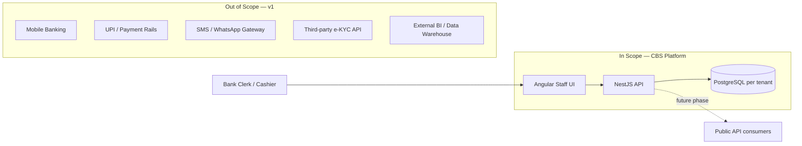

# System Boundaries — CBS SaaS Platform for Cooperative Banks

## Purpose

Defines what the CBS platform **includes** and **excludes** at the current project scope. Prevents undocumented assumptions during architecture, domain documentation, and code generation. When a feature is out of scope, it must not appear in business rules or API contracts unless explicitly marked as a future phase.

## Scope

Covers platform-wide boundaries for Year 1 (single-tenant pilot) through the documented 3-year horizon. Module-level boundaries will be refined in `02-business-domains/*/overview.md` as each domain is authored.

## Dependencies

- [vision.md](vision.md) — problem statement, target market, explicit non-goals
- [business-goals.md](business-goals.md) — BG-001 to BG-008 success criteria
- [glossary.md](glossary.md) — term definitions used below
- [../01-architecture/architecture-overview.md](../01-architecture/architecture-overview.md) — infrastructure scope
- [../cbs-project-execution-plan.md](../cbs-project-execution-plan.md) — phased delivery plan

---

## In Scope

### Core Banking Operations (Year 1 — BG-001)

The platform delivers back-office CBS operations for a Maharashtra cooperative bank tenant, covering the modules documented in `05-ui-ux/`:

| Module | In-scope capability |
| :--- | :--- |
| Customer | Customer registration, KYC document capture, customer list/search/export |
| Membership | New membership, share accounts, share transfer, dividend transactions |
| Savings | Account opening, transactions, manual interest |
| Fixed Deposit | Account opening, transactions, renewal, deposit loan, interest multiplier |
| Daily (Pigmy) | Account opening, agent management, collection, transactions |
| Recurring | Account opening, credit transactions, manual interest |
| Loan | New loan, deposit loan, loan information |
| Accounting | Jama, Nave, Transfer, Rokhapal, Multi-GL, Note Exchange |
| Settings | Schemes (all product types), GL Group/Head, users/roles/employees, share rules, dividend calculation, loan interest rate change |

**Year 1 success criterion (BG-001):** One live tenant; accounting reports reconcile accurately; year-end close completes without extensive manual correction.

### Multi-Tenancy & Isolation

- SaaS delivery model with **database-per-tenant** isolation on shared AWS infrastructure (DEC-001).
- Tenant routing via JWT `tenant_id` claim and control catalog.
- Year 1: one production tenant. Dev/QA validates two-tenant setup for migration rehearsal (DEC-005).

### Authentication & Authorization

- JWT-based login with tenant context.
- Role-based permission matrix: All Rights / View Only / No Rights per screen (User Role screen spec).
- Branch-scoped data access where configured.

### Interactive Reporting (BG-005)

- Search, column filtering, advanced search, and export on every list/register/grid screen.

### API Access (BG-006 — partial)

- Internal REST API backing the Angular frontend is in scope from Phase 2 onward.
- **Public/third-party API surface** (auth model, exposed modules, rate limits) is **not** defined yet — deferred to Phase 6 per execution plan.

### UI/UX

- Angular SPA with Marathi + English (ngx-translate).
- Angular Material components; responsive layout for clerk/cashier users (BG-004).
- HTML mockups for bank review before Angular implementation (tiered workflow in execution plan).

### Data Migration (Phase 5)

- Migration from incumbent CBS for the pilot tenant is **in scope** for go-live, but tooling and process are **not yet designed** — tracked in Phase 5 of the execution plan, not Year 1 documentation phase.

### Compliance Documentation (BG-008)

- `07-compliance/` cooperative banking accounting norms for **due diligence** — in scope as documentation.
- Compliance is **not** a sales driver or success metric.

---

## Out of Scope

### Geographic Expansion

- Cooperative banks **outside Maharashtra** within the current 1–3 year horizon ([vision.md](vision.md) explicit non-goal, BG-002).

### Regulatory-Mandated Migration

- The project is **not** driven by RBI or other regulatory mandate (BG-008). No RBI reporting module is in scope unless added by explicit future decision.

### Customer-Facing Channels

The following are **not** in scope for v1 unless explicitly added by future decision:

| Channel | Status | Notes |
| :--- | :--- | :--- |
| Mobile banking app | Out of scope | Architecture mentions UPI/mobile conventions as a reason for 24×7 prod uptime — that refers to **industry expectation**, not this product's feature set |
| UPI / IMPS / NEFT / RTGS integration | Out of scope | No payment rails integration documented |
| Internet banking (customer self-service) | Out of scope | Staff-operated back-office only |
| ATM integration | Out of scope | — |

### Payment Gateway & Payment Rails

- **No payment gateway or live payment-rail integration in v1** (UPI, IMPS, NEFT, RTGS gateways are out of scope).
- **v1 transaction modes:** Cash (Rokhapal and cash postings) and **Cheque** (receipt/issue recording in CBS — no live cheque clearing integration).

### SMS / WhatsApp Gateway

- **No SMS or WhatsApp gateway build in v1.**
- New Customer and Customer List screens include `SMS Alert` and `WhatsApp Alert` fields — these store **customer preference flags only**. No outbound notification integration at pilot.

### Third-Party KYC / Identity Verification

- New Customer screen originally showed `e-Verification` buttons for PAN and Aadhaar.
- **e-Verification is out of scope for v1** — remove e-Verification buttons from UI; manual PAN/Aadhaar entry and KYC document upload only.

### Custom Per-Tenant Development

- On-demand/custom functionality (BG-007 component 3) is a **commercial offering**, not part of the standard product scope. Custom work is scoped and billed per request.

### Built-In BI / Data Warehouse

- Standard interactive grid export (BG-005) is in scope.
- Separate data warehouse, OLAP, or external BI tool integration is out of scope.

---

## Deferred (Future Phases)

| Item | Target phase | Reference |
| :--- | :--- | :--- |
| Public API surface (modules, auth, rate limits) | Phase 6 (BG-006) | [business-goals.md](business-goals.md) |
| Tenants 2–10 (Maharashtra) | Phase 6 (BG-002) | [vision.md](vision.md) |
| RDS Proxy / PgBouncer | When tenants > 10–15 (DEC-002) | [architecture-overview.md](../01-architecture/architecture-overview.md) |
| Production security hardening (WAF, CMK, CloudTrail, RDS audit) | Phase 4, pre-go-live | Execution plan Phase 4 |
| Usability benchmark definition | Phase 5 UAT (BG-004) | [business-goals.md](business-goals.md) |
| Pricing / margin targets | Commercial decision (BG-003, BG-007) | Not a documentation blocker |
| Full `02-business-domains/` coverage | Phase 1.7 template + Phase 3 | Execution plan |
| `03-api-contracts/` and `04-database-design/` | Phase 1.8 + per-domain Phase 3 | Execution plan |

---

## Boundary Decisions Pending Confirmation

| # | Topic | Status |
| :---: | :--- | :--- |
| 1 | SMS/WhatsApp alerts | **Resolved:** preference flags only in v1 |
| 2 | PAN/Aadhaar e-Verification | **Resolved:** out of v1; remove buttons from UI |
| 3 | Transaction Mode values | **Resolved:** Cash + Cheque (no live clearing) in v1 |
| 4 | Cheque management | **Resolved:** in v1 as recording only |
| 5 | Printing (passbooks, receipts) | Not documented — confirm for pilot |
| 6 | Day-end / scroll close process | Scroll field on Rokhapal — confirm full cashier day-end in v1 |
| 7 | Multi-organization per tenant | One society assumed — confirm |

---

## System Context Diagram

---

## Related Documents

- [vision.md](vision.md)
- [business-goals.md](business-goals.md)
- [glossary.md](glossary.md)
- [../01-architecture/architecture-overview.md](../01-architecture/architecture-overview.md)
- [../cbs-project-execution-plan.md](../cbs-project-execution-plan.md)
- [../AI_INDEX.md](../AI_INDEX.md)
