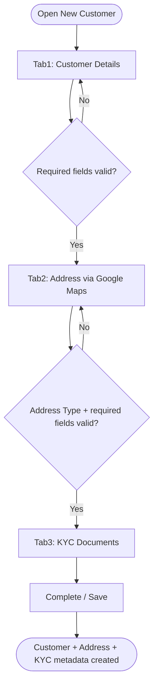
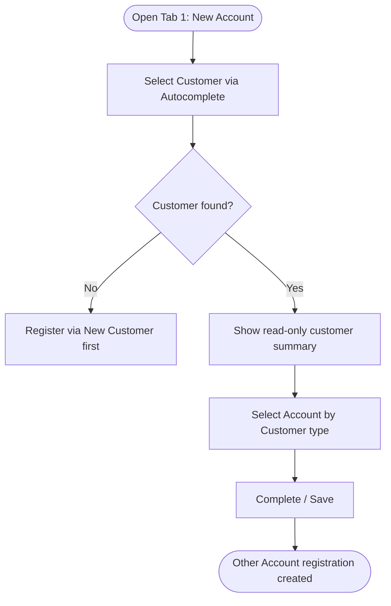

# Workflows — Customer

## Purpose

Step-by-step process flows for Customer module operations. Workflows reference business rules and use cases.

---

### WF-001 — New Customer registration wizard

| Property | Value |
| :--- | :--- |
| Trigger | Actor opens New Customer |
| Outcome | Customer + Address(es) + KYC document metadata persisted |
| Use case | [UC-001](use-cases.md#uc-001--register-a-new-customer) |

**Steps:**

1. **Tab 1 — Customer Details:** Optionally select Customer Type ([BR-002](business-rules.md#br-002--customer-type-optional-with-defined-values)); enter PAN/Aadhaar (manual only); Branch defaults to actor's branch ([BR-003](business-rules.md#br-003--branch-defaults-to-logged-in-branch-editable)); enter Salutation + Name ([BR-004](business-rules.md#br-004--salutation-and-name-required)), Date of Birth ([BR-005](business-rules.md#br-005--date-of-birth-required-age-auto-calculated)), Mobile Number ([BR-006](business-rules.md#br-006--mobile-number-required-one-per-customer)), Status ([BR-008](business-rules.md#br-008--customer-status-required-with-defined-values)). If Status = Deceased, enter Date of Death ([BR-009](business-rules.md#br-009--date-of-death-visible-only-when-status-is-deceased)). Optionally expand Advanced Settings for alert preferences ([BR-010](business-rules.md#br-010--alert-checkboxes-are-preference-flags-only)) and a single Nominee ([BR-011](business-rules.md#br-011--nominee-section-conditional-on-add-nominee-checkbox)–[BR-014](business-rules.md#br-014--nominee-relation-reuses-canonical-membership-list)).
2. **Tab 2 — Address:** Search and select a place via Google Maps Places Autocomplete ([BR-015](business-rules.md#br-015--address-captured-via-google-maps-autocomplete)); system auto-fills Address/Building, Location, State, District, Taluka, City, Pin Code ([BR-017](business-rules.md#br-017--required-address-sub-fields-from-google-maps)); select Address Type ([BR-016](business-rules.md#br-016--address-type-required)); click Add to append to the address grid. Optionally check Contact Same as Permanent ([BR-018](business-rules.md#br-018--contact-same-as-permanent-copies-address)) to copy the Permanent row into a Contact row. Repeat for additional address rows.
3. **Tab 3 — KYC Documents:** Optionally upload Photo, Signature, Address Proof, Identity Proof, Original Aadhaar Photo document cards; Document Number entered only for Address/Identity Proof ([BR-020](business-rules.md#br-020--document-number-required-only-for-address-and-identity-proof)). Missing mandatory documents do not block the next step ([BR-019](business-rules.md#br-019--kyc-mandatory-documents-do-not-block-save)).
4. **Complete/Save:** Validate Tabs 1–2 field rules; persist Customer, Address(es), and KYC metadata atomically only on this final action ([BR-021](business-rules.md#br-021--new-customer-wizard-atomic-save-on-create)). Next/Back never persist partial records.

**Exceptions:**
- Validation failure on Tab 1 or Tab 2 blocks Next or Save with a field-level error.
- Google Maps returning no place suggestions requires the actor to refine the search text; the wizard does not proceed to Tab 2's grid Add without a resolved place.
- Reset clears all tab state without persisting.

**Referenced Rules:** BR-001 through BR-021

---

### WF-002 — Customer search and list

| Property | Value |
| :--- | :--- |
| Trigger | Actor opens Customer List, optionally with filters |
| Outcome | Filtered customer results rendered in the grid |
| Use case | [UC-002](use-cases.md#uc-002--search-and-view-customer-list) |

**Steps:**
1. Actor optionally sets Primary Search filters (Branch, Name, Customer No. range, Status) and Advance Search (Masters Passing).
2. Actor clicks Show ([BR-023](business-rules.md#br-023--customer-list-search-filter-and-export-standard)).
3. System resolves the effective branch scope for the actor's session ([BR-024](business-rules.md#br-024--customer-list-branch-scoped-results-eligibility), TODO) and applies filters.
4. Grid renders default columns; Details/Export expose additional columns or a downloadable result set.

**Exceptions:**
- No matches renders an empty grid state, not an error.

**Referenced Rules:** BR-008, BR-023, BR-024

---

### WF-003 — Open Other Account for an existing customer

| Property | Value |
| :--- | :--- |
| Trigger | Actor opens Other Account Management Tab 1 |
| Outcome | Other Account registration created for (Customer, Account by Customer type) |
| Use case | [UC-003](use-cases.md#uc-003--open-an-other-account-for-an-existing-customer) |

**Steps:**

1. Actor optionally narrows by Branch and Status, then resolves the Customer via Autocomplete ([BR-026](business-rules.md#br-026--customer-must-exist-before-other-account-can-be-opened)).
2. System shows the customer's Customer No., Name, Address, Mobile Number read-only.
3. Actor selects Account by Customer type ([BR-027](business-rules.md#br-027--account-by-customer-type-required-with-defined-values)).
4. Actor clicks Complete/Save; system checks for a duplicate (Customer, type) pair — behaviour TODO ([BR-029](business-rules.md#br-029--duplicate-other-account-prevention)) — then persists the registration with initial status `चालू`.

**Exceptions:**
- Customer not found via Autocomplete — actor must complete [WF-001](#wf-001--new-customer-registration-wizard) first.
- Account by Customer left at placeholder blocks Save.

**Referenced Rules:** BR-026, BR-027, BR-028, BR-029, BR-030

---

### WF-004 — Other Account registration bulk maintenance

| Property | Value |
| :--- | :--- |
| Trigger | Actor opens Other Account Management Tab 2 with filters |
| Outcome | Selected registrations updated (status change) or removed |
| Use case | [UC-004](use-cases.md#uc-004--maintain-other-account-registrations-in-bulk) |

**Steps:**
1. Actor sets required filters — Branch, Account by Customer, Status ([BR-031](business-rules.md#br-031--registration-list-filters-required)) — and optional Customer No. range.
2. Actor clicks Show; grid renders matching registrations.
3. Actor selects one or more rows (or Select all).
4. **Status update path:** Account Status section appears ([BR-033](business-rules.md#br-033--account-status-update-visible-only-when-rows-selected)); actor picks a new status from the three-value registration status domain ([BR-030](business-rules.md#br-030--other-account-registration-status-distinct-from-customer-status)) and clicks Save, or Revert to discard.
5. **Remove path:** Actor clicks Remove; confirmation dialog appears ([BR-032](business-rules.md#br-032--bulk-remove-requires-confirmation)); on confirm, selected rows are deleted.

**Exceptions:**
- Missing required filter blocks Show.
- Account Status section stays hidden with zero rows selected.

**Referenced Rules:** BR-030, BR-031, BR-032, BR-033

---

### Permission enforcement (cross-cutting)

Applies identically to all three Customer screens. Not duplicated here — see [settings/master/workflows.md WF-003](../settings/master/workflows.md#wf-003--permission-enforcement-at-runtime) and [BR-022](business-rules.md#br-022--customer-screens-use-master-permission-levels).

---

## Related Documents

- [overview.md](overview.md)
- [business-rules.md](business-rules.md)
- [use-cases.md](use-cases.md)
- [acceptance-tests.md](acceptance-tests.md)
- [../settings/master/workflows.md](../settings/master/workflows.md)
