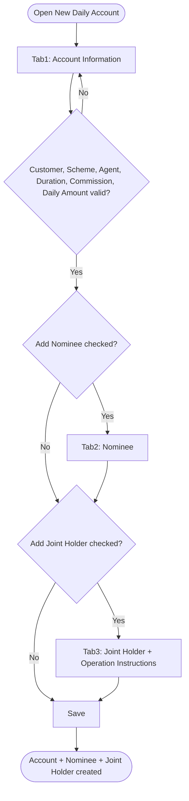
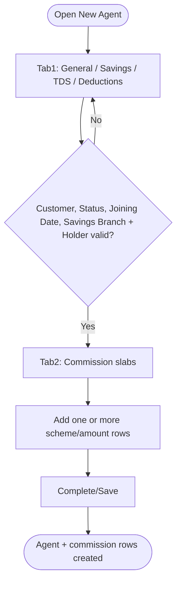
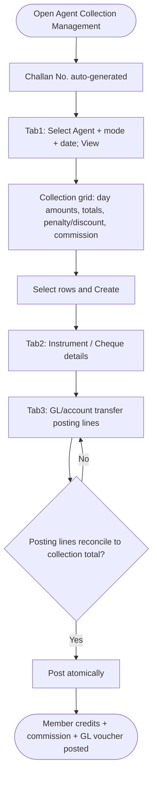
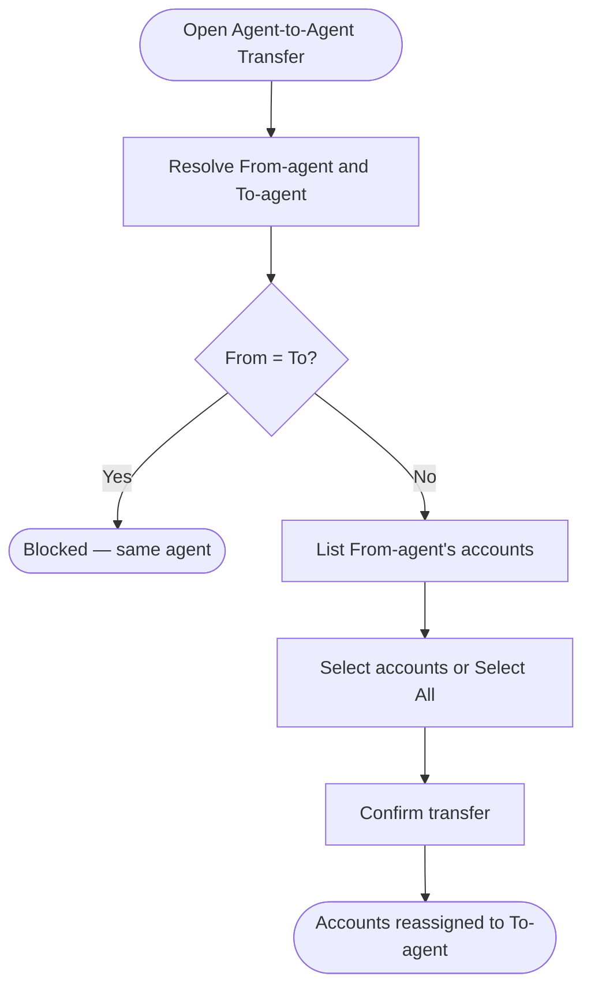

# Workflows — Daily (Pigmy)

## Purpose

Step-by-step process flows for Daily module operations. Workflows reference business rules ([business-rules.md](business-rules.md), [business-rules-part2.md](business-rules-part2.md)) and use cases.

---

### WF-001 — New Daily Account wizard

| Property | Value |
| :--- | :--- |
| Trigger | Actor opens New Daily Account |
| Outcome | Account + optional Nominee(s) + Joint Holder(s) persisted |
| Use case | [UC-001](use-cases.md#uc-001--open-a-new-daily-account) |

**Steps:**

1. **Tab 1 — Account Information:** Resolve Customer ([BR-001](business-rules.md#br-001--customer-must-exist-before-a-daily-account-can-be-opened)); select Scheme ([BR-002](business-rules.md#br-002--scheme-required-and-loaded-from-daily-scheme-master)), Agent Branch + Agent ([BR-003](business-rules.md#br-003--agent-branch-and-agent-required-agent-must-be-registered-first)), Duration (rate auto-fills, [BR-005](business-rules.md#br-005--duration-selected-from-scheme-grid-duration-and-rate-auto-filled)); enter Commission Rate ([BR-006](business-rules.md#br-006--commission-rate-required-at-account-opening)), Daily Deposit Amount ([BR-008](business-rules.md#br-008--daily-deposit-amount-required-maturity-fields-optional)), Status ([BR-009](business-rules.md#br-009--account-status-default-and-shared-values-across-deposit-products)); optionally Advanced ([BR-010](business-rules.md#br-010--pigmy-account-for-loan-flag-depends-on-undocumented-loan-domain)–[BR-012](business-rules.md#br-012--advanced-overrides-optional-with-scheme-defaults)); optionally enable Nominee/Joint Holder tabs ([BR-013](business-rules.md#br-013--nominee-section-conditional-on-add-nominee-checkbox), [BR-014](business-rules.md#br-014--joint-holder-section-conditional-on-add-joint-holder-checkbox)).
2. **Tab 2 — Nominee (if enabled):** Resolve/quick-add nominee Customer ([BR-015](business-rules.md#br-015--nominee-lookup-resolves-to-existing-or-quick-added-customer)); select Relation ([BR-016](business-rules.md#br-016--nominee-relation-reuses-canonical-membership-list)); Percentage optional, Date/Age derived ([BR-017](business-rules.md#br-017--nominee-percentage-optional-nomination-date-and-age-system-derived)); Add.
3. **Tab 3 — Joint Holder (if enabled):** Optional Guardian; resolve joint holder; Add validates selection ([BR-018](business-rules.md#br-018--joint-holder-guardian-and-customer-add-validates-selection)); select Account Operation Instructions ([BR-019](business-rules.md#br-019--account-operation-instructions-required-with-defined-values)).
4. **Save:** Validate all visible tabs; persist Account, Nominee(s), Joint Holder(s) atomically only on this final action ([BR-020](business-rules.md#br-020--new-daily-account-wizard-atomic-save-on-create)). Account No. auto-generated ([BR-004](business-rules.md#br-004--account-no-auto-generated)).

**Exceptions:**
- Validation failure blocks Next/Save with a field-level error.
- Customer or Agent not resolvable blocks the wizard — register via New Customer / New Agent first.
- Reset clears state without persisting.

**Referenced Rules:** BR-001 through BR-020

---

### WF-002 — New Agent wizard

| Property | Value |
| :--- | :--- |
| Trigger | Actor opens New Agent |
| Outcome | Agent + commission slab row(s) persisted |
| Use case | [UC-002](use-cases.md#uc-002--register-a-new-collection-agent) |

**Steps:**

1. **Tab 1 — निधी माहिती:** Resolve Customer for agent identity ([BR-021](business-rules.md#br-021--agent-identity-requires-an-existing-customer)); set Status + Joining Date ([BR-022](business-rules.md#br-022--agent-status-and-joining-date-required)); select linked savings Branch + Account Holder ([BR-023](business-rules.md#br-023--agent-linked-savings-account-branch-and-account-holder-required)); optional TDS reason ([BR-024](business-rules.md#br-024--tds-reason-conditional-on-tds--no)); optional deduction blocks ([BR-025](business-rules.md#br-025--agent-deduction-blocks-conditional-on-their-checkboxes)).
2. **Tab 2 — प्रतिनिधी माहिती:** Select Scheme, Commission %, From/Up-to Amount; + टाका adds slab rows ([BR-026](business-rules.md#br-026--agent-commission-config-per-scheme-and-amount-slab)).
3. **Complete/Save:** Validate all tabs; persist Agent + commission rows atomically ([BR-027](business-rules.md#br-027--new-agent-wizard-atomic-save-on-create)).

**Exceptions:**
- Customer not found blocks the wizard ([BR-021](business-rules.md#br-021--agent-identity-requires-an-existing-customer)).
- Missing required fields block Next/Complete.
- Next/Back never persist partial records.

**Referenced Rules:** BR-021 through BR-027

---

### WF-003 — Agent collection capture and posting

| Property | Value |
| :--- | :--- |
| Trigger | Actor opens Agent Collection Management and views a collection |
| Outcome | Member-account credits + agent commission + GL transfer voucher posted under one Challan |
| Use case | [UC-003](use-cases.md#uc-003--record-and-post-an-agent-daily-collection) |

**Steps:**

1. Challan Number is generated ([BR-034](business-rules-part2.md#br-034--challan-number-auto-generated)).
2. **Tab 1:** Select Agent, Cash/Transfer, Collection Amount, One Day/Multiple Days, Collection Date; optional Scheme/account filters; click बघा ([BR-035](business-rules-part2.md#br-035--collection-requires-agent-and-mode-selections-grid-loaded-on-view)). Grid computes day totals, RD penalty/discount, agent commission ([BR-036](business-rules-part2.md#br-036--collection-grid-computes-totals-penalty-discount-and-commission)). Select rows; निर्मीती करा.
3. **Tab 2:** Confirm instrument; Cheque fields required for Cheque type ([BR-038](business-rules-part2.md#br-038--brief-details-instrument-fields-conditional-on-cheque)).
4. **Tab 3:** Add GL/account posting lines reconciling to the collection total ([BR-039](business-rules-part2.md#br-039--transfer-tab-posting-lines-reconcile-to-collection-total)).
5. **Post:** On the final posting action, atomically post member-account credits, agent commission, and the balancing GL transfer voucher ([BR-037](business-rules-part2.md#br-037--agent-collection-is-the-posting-point-for-daily-collections)).

**Exceptions:**
- Empty grid (no accounts) → nothing to post.
- `TODO:` behaviour when posting lines do not balance ([BR-039](business-rules-part2.md#br-039--transfer-tab-posting-lines-reconcile-to-collection-total)).
- Cash-mode cashier hand-off and voucher/scroll numbering are `TODO:` ([BR-037](business-rules-part2.md#br-037--agent-collection-is-the-posting-point-for-daily-collections) Notes).

**Referenced Rules:** BR-034 through BR-039

---

### WF-004 — Collection List review

| Property | Value |
| :--- | :--- |
| Trigger | Actor opens the कलेक्शन यादी tab |
| Outcome | Historical collections listed with totals |
| Use case | [UC-003](use-cases.md#uc-003--record-and-post-an-agent-daily-collection) A2 |

**Steps:**
1. Actor enters required Branch + Agent and an optional Scheme / date range ([BR-040](business-rules-part2.md#br-040--collection-list-search-requires-branch-and-agent)).
2. Actor clicks दाखवा; system lists each collection's Agent Name, Transaction Date, and Collection Amount with an एकूण total.
3. Actor optionally clicks तपशील or निर्यात करा.

**Exceptions:**
- Missing Branch or Agent blocks Show.

**Referenced Rules:** BR-040

---

### WF-005 — Agent-to-agent account reassignment

| Property | Value |
| :--- | :--- |
| Trigger | Actor opens Agent-to-Agent Transfer |
| Outcome | Selected accounts' collecting-agent binding moved to the To-agent |
| Use case | [UC-004](use-cases.md#uc-004--reassign-accounts-between-agents) |

**Steps:**

1. Resolve Agent (From) and Agent (To) ([BR-041](business-rules-part2.md#br-041--from-and-to-agent-required-selection-reassigns-accounts)); grid lists the From-agent's bound accounts ([BR-042](business-rules-part2.md#br-042--only-the-from-agents-accounts-are-listed-for-reassignment)).
2. Select accounts (or सर्व निवडा) and confirm — the system reassigns the collecting-agent binding to the To-agent ([BR-041](business-rules-part2.md#br-041--from-and-to-agent-required-selection-reassigns-accounts)). निर्यात करा exports the list without reassigning.

**Exceptions:**
- From = To blocks the transfer ([BR-041](business-rules-part2.md#br-041--from-and-to-agent-required-selection-reassigns-accounts)).
- `TODO:` same-branch restriction and confirmation dialog unconfirmed.

**Referenced Rules:** BR-041, BR-042

---

### WF-006 — Daily account search and removal (Account Register)

| Property | Value |
| :--- | :--- |
| Trigger | Actor opens Account Register, optionally with filters |
| Outcome | Filtered results rendered; selected registration row removed |
| Use case | [UC-005](use-cases.md#uc-005--search-and-maintain-daily-accounts-via-account-register) |

**Steps:**
1. Organization header shows read-only from session ([BR-028](business-rules-part2.md#br-028--organization-auto-fill-header-from-session)).
2. Actor optionally sets any combination of Branch, Scheme, Agent, Account No. range, Customer No. range, Account Holder, Status ([BR-029](business-rules-part2.md#br-029--account-register-primary-search-fields-all-optional), [BR-030](business-rules-part2.md#br-030--status-filter-shares-deposit-product-enum)); clicks दाखवा.
3. Grid renders with pagination/totals; loan-linked rows pink, matured rows light blue ([BR-031](business-rules-part2.md#br-031--results-grid-legend-loan-linked-and-matured-highlighting), [BR-033](business-rules-part2.md#br-033--account-register-follows-interactive-reporting-detail-and-statement-gaps)).
4. **View path:** तपशील / निर्यात करा / खाते उतारा ([BR-033](business-rules-part2.md#br-033--account-register-follows-interactive-reporting-detail-and-statement-gaps), TODO).
5. **Remove path:** काढा deletes the selected account registration row ([BR-032](business-rules-part2.md#br-032--काढा-remove-deletes-the-account-registration-row)).

**Exceptions:**
- No matches → empty grid, not an error.
- `TODO:` remove behaviour on accounts with posted transaction history ([BR-032](business-rules-part2.md#br-032--काढा-remove-deletes-the-account-registration-row) Notes).
- The Daily register has no Close Account action (unlike Savings) — closure is not initiated here.

**Referenced Rules:** BR-028 through BR-033

---

### WF-007 — Interest multiplier calculation

| Property | Value |
| :--- | :--- |
| Trigger | Actor opens Interest Multiplier |
| Outcome | Interest/maturity preview computed (no persistence) |
| Use case | [UC-006](use-cases.md#uc-006--calculate-daily-interest-and-maturity-interest-multiplier) |

**Steps:**
1. Select Scheme — Duration and Rate auto-fill ([BR-043](business-rules-part2.md#br-043--interest-multiplier-scheme-required-duration-and-rate-auto-filled)); optionally choose Simple/Compound and frequency.
2. Enter Deposit Amount; click गणना करा — system computes Total/Interest/Maturity and the daily chart ([BR-044](business-rules-part2.md#br-044--deposit-amount-required-calculation-is-preview-only)).
3. पुनर्रचना करा resets inputs. No data is persisted.

**Exceptions:**
- Missing Scheme or Deposit Amount blocks Calculate.

**Referenced Rules:** BR-043, BR-044

---

### Permission enforcement (cross-cutting)

Applies identically to all Daily screens. Not duplicated here — see [settings/master/workflows.md WF-003](../settings/master/workflows.md#wf-003--permission-enforcement-at-runtime) and [BR-045](business-rules-part2.md#br-045--daily-screens-use-master-permission-levels).

---

## Related Documents

- [overview.md](overview.md)
- [business-rules.md](business-rules.md)
- [business-rules-part2.md](business-rules-part2.md)
- [use-cases.md](use-cases.md)
- [acceptance-tests.md](acceptance-tests.md)
- [../settings/master/workflows.md](../settings/master/workflows.md)
