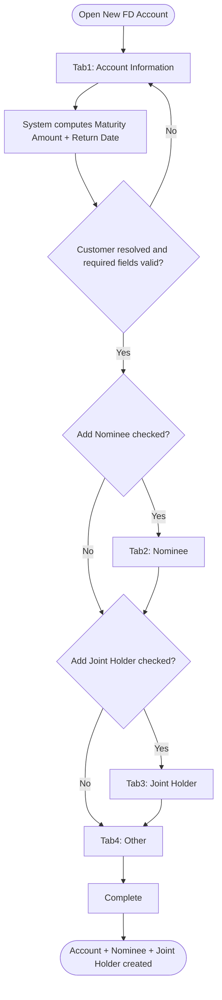
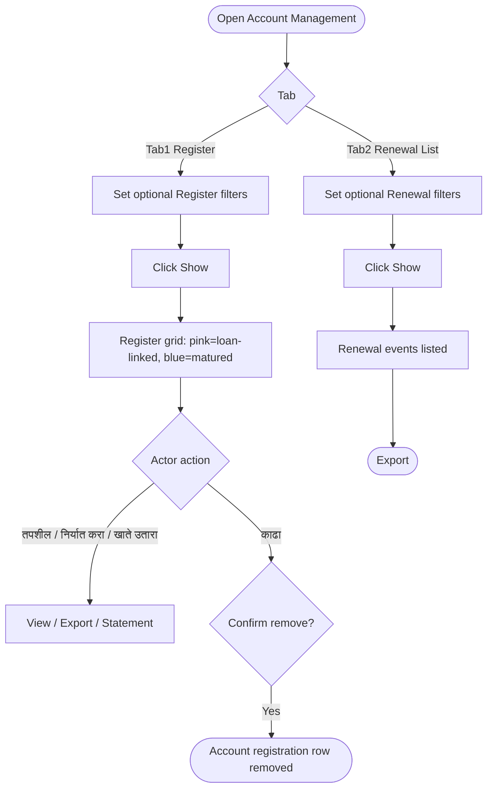
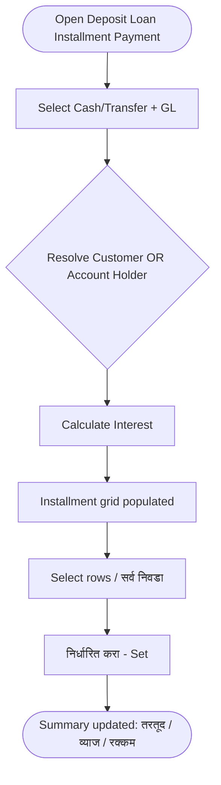

# Workflows — Fixed Deposit

## Purpose

Step-by-step process flows for Fixed Deposit module operations. Workflows reference business rules and use cases.

---

### WF-001 — New FD Account wizard

| Property | Value |
| :--- | :--- |
| Trigger | Actor opens New FD Account |
| Outcome | FD Account + Nominee(s) + Joint Holder(s) persisted |
| Use case | [UC-001](use-cases.md#uc-001--open-a-new-fd-account) |

**Steps:**

1. **Tab 1 — Account Information:** Resolve Customer ([BR-001](business-rules.md#br-001--customer-must-exist-before-fd-account-can-be-opened)); select Scheme — scheme attributes auto-fill ([BR-002](business-rules.md#br-002--scheme-required-and-loaded-from-fd-scheme-master), [BR-003](business-rules.md#br-003--scheme-derived-attributes-auto-filled-read-only)); optional Agent ([BR-004](business-rules.md#br-004--agent-and-sales-agent-optional-agent-scoped-to-agent-branch)); select Account Type ([BR-006](business-rules.md#br-006--account-type-required-with-defined-values)) and Interest Rate Slab — Duration + Rate auto-fill ([BR-007](business-rules.md#br-007--interest-rate-slab-required-and-drives-duration), [BR-010](business-rules.md#br-010--interest-rate-auto-filled-from-slab-admin-override-role-undefined)); enter FD Amount ([BR-009](business-rules.md#br-009--fd-amount-required)), Interest Start Date ([BR-011](business-rules.md#br-011--interest-start-date-required)); system computes Maturity Amount / Return Date / Receipt Date ([BR-012](business-rules.md#br-012--maturity-amount-return-date-and-receipt-date-system-computed)); set Status ([BR-013](business-rules.md#br-013--account-status-default-and-shared-values-across-deposit-products)); optional IFSC payout ([BR-014](business-rules.md#br-014--ifsc-code-enables-bank-payout-auto-fill)) and Advanced Settings ([BR-015](business-rules.md#br-015--advanced-settings-visibility-role-undefined)–[BR-017](business-rules.md#br-017--multiple-fd-workflow-semantics-undefined)); optionally check Add Nominee / Add Joint Holder ([BR-018](business-rules.md#br-018--nominee-section-conditional-on-add-nominee-checkbox), [BR-019](business-rules.md#br-019--joint-holder-section-conditional-on-add-joint-holder-checkbox)).
2. **Tab 2 — Nominee (if enabled):** Resolve nominee Customer or quick-add ([BR-020](business-rules.md#br-020--nominee-lookup-resolves-to-existing-or-quick-added-customer)); select Relation ([BR-021](business-rules.md#br-021--nominee-relation-reuses-canonical-membership-list)); Percentage optional, date/age derived ([BR-022](business-rules.md#br-022--nominee-percentage-optional-nomination-date-and-age-system-derived)); Add to grid.
3. **Tab 3 — Joint Holder (if enabled):** Optional Guardian; resolve joint holder; Add validates selection ([BR-023](business-rules.md#br-023--joint-holder-guardian-and-customer-fields-add-validates-selection)); select Account Operation Instructions ([BR-024](business-rules.md#br-024--account-operation-instructions-required-with-defined-values)).
4. **Tab 4 — Other:** Optional Interest Reinvestment ([BR-025](business-rules.md#br-025--interest-reinvestment-enables-si-reinvestment-frequency)), Auto Renewal / Renewal type ([BR-026](business-rules.md#br-026--auto-renewal-and-renewal-mutually-exclusive-renewal-type-radios)), Interest Transfer routing ([BR-027](business-rules.md#br-027--interest-transfer-enables-gl-holder-and-frequency-routing)), Account Closing routing ([BR-028](business-rules.md#br-028--account-closing-gl-routing-enabled-by-checkbox)).
5. **Complete:** Validate all visible tabs; persist Account, Nominee(s), Joint Holder(s) atomically only on this final action ([BR-029](business-rules.md#br-029--new-fd-account-wizard-atomic-save-on-create)). Next/Back never persist; Reset clears state.

**Exceptions:**
- Validation failure on any visible tab blocks Next or Complete with a field-level error.
- Customer not found on Tab 1 blocks the wizard — actor must complete New Customer registration first.
- Multiple FD block behaviour is unresolved ([BR-017](business-rules.md#br-017--multiple-fd-workflow-semantics-undefined), TODO) — affects how many accounts one Complete persists.

**Referenced Rules:** BR-001 through BR-029

---

### WF-002 — FD account search, renewal-history view, and removal

| Property | Value |
| :--- | :--- |
| Trigger | Actor opens FD Account Management |
| Outcome | Filtered results rendered; selected registration row removed; renewal events listed/exported |
| Use case | [UC-002](use-cases.md#uc-002--search-and-maintain-fd-accounts-and-renewal-history) |

**Steps:**

1. Organization header auto-fills read-only ([BR-031](business-rules.md#br-031--account-management-search-fields-all-optional-organization-auto-filled)).
2. **Register (Tab 1):** Actor sets any combination of optional filters and clicks Show ([BR-031](business-rules.md#br-031--account-management-search-fields-all-optional-organization-auto-filled)); grid renders with pagination and totals ([BR-033](business-rules.md#br-033--account-management-follows-interactive-reporting-standard)); loan-linked rows pink, matured rows blue ([BR-032](business-rules.md#br-032--register-grid-legend-loan-linked-and-matured-accounts)).
3. **View path:** Actor clicks तपशील, निर्यात करा, or खाते उतारा ([BR-035](business-rules.md#br-035--account-statement-and-details-lack-dedicated-specs), TODO on Details/Statement).
4. **Remove path:** Actor clicks काढा; system deletes the selected account registration row ([BR-034](business-rules.md#br-034--काढा-remove-deletes-the-account-registration-row)).
5. **Renewal List (Tab 2):** Actor sets optional filters (including Renewal Date range, Receipt Number), clicks Show, and Exports; the list is read-only ([BR-036](business-rules.md#br-036--renewal-list-is-read-and-export-only)).

**Exceptions:**
- No matches renders an empty grid state, not an error.
- Remove behaviour on accounts with posted transaction history is `TODO:` unresolved ([BR-034](business-rules.md#br-034--काढा-remove-deletes-the-account-registration-row) Notes).
- The source that generates Renewal List events is `TODO:` unresolved ([BR-036](business-rules.md#br-036--renewal-list-is-read-and-export-only) Notes).

**Referenced Rules:** BR-030 through BR-036

---

### WF-003 — Deposit-loan installment payment

| Property | Value |
| :--- | :--- |
| Trigger | Actor opens Deposit Loan Installment Payment |
| Outcome | Installments calculated and applied against an existing deposit loan |
| Use case | [UC-003](use-cases.md#uc-003--record-a-deposit-loan-installment-payment) |

**Steps:**

1. Actor selects Cash/Transfer mode and GL, then resolves the loan by Customer **or** Account Holder ([BR-038](business-rules.md#br-038--installment-interest-tab-requires-mode-gl-and-a-customer-or-account-holder-lookup)); the payment targets a loan that already exists ([BR-037](business-rules.md#br-037--deposit-loan-must-exist-before-installment-payment)).
2. Actor clicks Calculate Interest; grid populates with per-account installment lines ([BR-039](business-rules.md#br-039--calculate-interest-populates-installment-grid-set-applies)).
3. Actor selects rows and clicks Set; the summary totals update ([BR-039](business-rules.md#br-039--calculate-interest-populates-installment-grid-set-applies)).

**Exceptions:**
- Resolved party has no active deposit loan → no installment lines returned ([BR-037](business-rules.md#br-037--deposit-loan-must-exist-before-installment-payment)).
- Interest basis and what "Set" persists are `TODO:` pending the Loan domain ([BR-039](business-rules.md#br-039--calculate-interest-populates-installment-grid-set-applies)).
- Tabs 2–6 (Other Deductions / Loan Information / Collateral / Transfer / KYC) are uncaptured ([BR-040](business-rules.md#br-040--deposit-loan-installment-tabs-26-not-captured), TODO).

**Referenced Rules:** BR-030, BR-037 through BR-040

---

### WF-004 — FD interest/duration calculation (Interest Multiplier)

| Property | Value |
| :--- | :--- |
| Trigger | Actor opens FD Interest Multiplier |
| Outcome | Interest Rate or Duration computed and displayed (no persistence) |
| Use case | [UC-004](use-cases.md#uc-004--calculate-fd-interest-rate-or-duration) |

**Steps:**

1. Actor selects an FD Scheme; option controls become visible ([BR-042](business-rules.md#br-042--interest-multiplier-conditional-field-visibility)).
2. Actor sets product type, Simple/Compounding (+ Frequency if Compounding), Duration in Days/Months, and the calculation target (Interest Rate vs. Duration) ([BR-042](business-rules.md#br-042--interest-multiplier-conditional-field-visibility), [BR-043](business-rules.md#br-043--interest-multiplier-computes-interest-rate-or-duration)).
3. Actor enters the applicable Duration value and clicks Calculate; system shows read-only Interest Rate and Date Difference outputs ([BR-043](business-rules.md#br-043--interest-multiplier-computes-interest-rate-or-duration)).
4. Reset clears the form; nothing is persisted ([BR-041](business-rules.md#br-041--interest-multiplier-is-a-scheme-based-calculator-with-no-persistence)).

**Exceptions:**
- Compounding Frequency is hidden unless Compounding is selected ([BR-042](business-rules.md#br-042--interest-multiplier-conditional-field-visibility)).
- Exact day-count/compounding formula is `TODO:` ([BR-043](business-rules.md#br-043--interest-multiplier-computes-interest-rate-or-duration)).

**Referenced Rules:** BR-030, BR-041 through BR-043

---

### Permission enforcement (cross-cutting)

Applies identically to all four FD screens. Not duplicated here — see [settings/master/workflows.md WF-003](../settings/master/workflows.md#wf-003--permission-enforcement-at-runtime) and [BR-030](business-rules.md#br-030--fd-screens-use-master-permission-levels).

---

## Related Documents

- [overview.md](overview.md)
- [business-rules.md](business-rules.md)
- [use-cases.md](use-cases.md)
- [acceptance-tests.md](acceptance-tests.md)
- [../settings/master/workflows.md](../settings/master/workflows.md)
