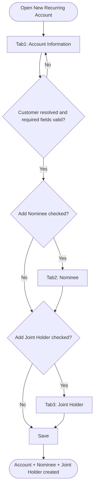
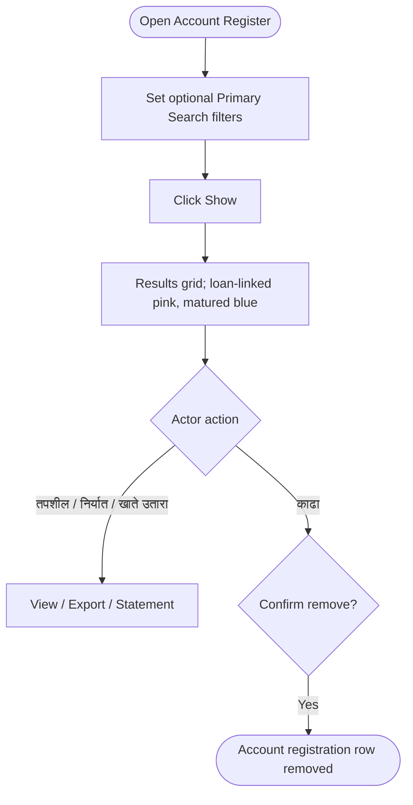
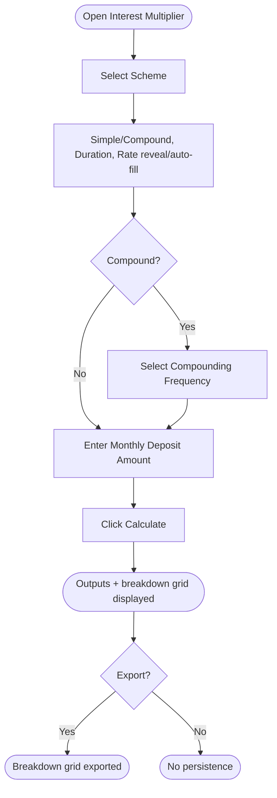

# Workflows — Recurring (Recurring Deposit)

## Purpose

Step-by-step process flows for Recurring module operations. Workflows reference business rules and use cases.

---

### WF-001 — New Recurring Account wizard

| Property | Value |
| :--- | :--- |
| Trigger | Actor opens New Recurring Account |
| Outcome | Account + Nominee(s) + Joint Holder(s) persisted |
| Use case | [UC-001](use-cases.md#uc-001--open-a-new-recurring-deposit-account) |

**Steps:**

1. **Tab 1 — Account Information:** Resolve Customer ([BR-001](business-rules.md#br-001--customer-must-exist-before-recurring-account-can-be-opened)); select Scheme ([BR-002](business-rules.md#br-002--scheme-required-and-loaded-from-recurring-scheme-master)) — Interest Type/Compounding auto-fill ([BR-003](business-rules.md#br-003--scheme-derived-attributes-auto-filled-read-only)); optionally resolve Agent ([BR-004](business-rules.md#br-004--agent-and-sales-agent-optional-agent-scoped-to-agent-branch)); select Account Type ([BR-006](business-rules.md#br-006--account-type-required-with-defined-values)) and Duration — Duration (Months) and Interest Rate auto-fill ([BR-007](business-rules.md#br-007--duration-selected-from-scheme-grid-duration-and-rate-auto-filled)), Maturity Date computed ([BR-010](business-rules.md#br-010--maturity-date-system-calculated)); enter Opening Date ([BR-009](business-rules.md#br-009--account-opening-date-defaults-to-system-date)), Installment Amount ([BR-011](business-rules.md#br-011--installment-amount-required)), Deposit Type ([BR-012](business-rules.md#br-012--deposit-type-required-frequency-values-todo)), Status ([BR-014](business-rules.md#br-014--account-status-default-and-shared-values-across-deposit-products)); Maturity Amount computed read-only ([BR-013](business-rules.md#br-013--maturity-amount-system-computed-from-scheme-interest-formula)); optionally expand Advanced Settings ([BR-015](business-rules.md#br-015--advanced-settings-visibility-role-undefined), [BR-016](business-rules.md#br-016--ifsc-code-enables-bank-payout-auto-fill)); optionally check Add Nominee / Add Joint Holder ([BR-017](business-rules.md#br-017--nominee-section-conditional-on-add-nominee-checkbox), [BR-018](business-rules.md#br-018--joint-holder-section-conditional-on-add-joint-holder-checkbox)).
2. **Tab 2 — Nominee (if enabled):** Resolve nominee Customer or quick-add ([BR-019](business-rules.md#br-019--nominee-lookup-resolves-to-existing-or-quick-added-customer)); select Relation from canonical list ([BR-020](business-rules.md#br-020--nominee-relation-reuses-canonical-membership-list)); Percentage optional, Nomination Date and Age system-derived ([BR-021](business-rules.md#br-021--nominee-percentage-optional-nomination-date-and-age-system-derived)); Add to grid.
3. **Tab 3 — Joint Holder (if enabled):** Optionally check Guardian; resolve joint holder Customer; Add validates selection ([BR-022](business-rules.md#br-022--joint-holder-guardian-and-customer-fields-add-validates-selection)); select Account Operation Instructions ([BR-023](business-rules.md#br-023--account-operation-instructions-required-with-defined-values)).
4. **Save:** Validate all visible tabs; persist Account, Nominee(s), Joint Holder(s) atomically only on this final action ([BR-024](business-rules.md#br-024--new-recurring-account-wizard-atomic-save-on-create)). Next/Back never persist partial records.

**Exceptions:**
- Validation failure on any visible tab blocks Next or Save with a field-level error.
- Customer not found on Tab 1 blocks the wizard entirely — actor must complete New Customer registration first.
- Reset clears all tab state without persisting.

**Referenced Rules:** BR-001 through BR-024

---

### WF-002 — Recurring account search and removal

| Property | Value |
| :--- | :--- |
| Trigger | Actor opens Account Register, optionally with filters |
| Outcome | Filtered results rendered; selected account removed/exported |
| Use case | [UC-002](use-cases.md#uc-002--search-view-remove-and-export-recurring-accounts-via-account-register) |

**Steps:**

1. Actor optionally sets any combination of Branch, Scheme, Status, Account No. range, Account Holder, Customer No. range ([BR-027](business-rules.md#br-027--account-register-primary-search-fields-all-optional)); the Organization header is auto-filled ([BR-026](business-rules.md#br-026--organization-auto-fill-header-from-session)).
2. Actor clicks Show ([BR-030](business-rules.md#br-030--account-register-follows-interactive-reporting-standard)); grid renders with pagination and record count; loan-linked rows render pink, matured rows blue ([BR-028](business-rules.md#br-028--results-grid-legend-loan-linked-and-matured-highlighting), TODO).
3. **View path:** Actor clicks तपशील, निर्यात, or खाते उतारा for the selected row ([BR-031](business-rules.md#br-031--account-details-and-account-statement-lack-dedicated-specs), TODO on underlying screens/reports).
4. **Remove path:** Actor clicks काढा; system deletes the selected account registration row ([BR-029](business-rules.md#br-029--काढा-remove-deletes-the-account-registration-row)).

**Exceptions:**
- No matches renders an empty grid state, not an error.
- Remove behaviour on accounts with posted installment history is `TODO:` unresolved ([BR-029](business-rules.md#br-029--काढा-remove-deletes-the-account-registration-row) Notes).

**Referenced Rules:** BR-025 through BR-031

---

### WF-003 — Recurring Interest Multiplier calculation

| Property | Value |
| :--- | :--- |
| Trigger | Actor opens Interest Multiplier |
| Outcome | Deposit/Interest/Maturity amounts and breakdown grid computed (no persistence) |
| Use case | [UC-003](use-cases.md#uc-003--preview-recurring-deposit-maturity-via-interest-multiplier) |

**Steps:**

1. Actor selects Scheme; option controls reveal and Duration/Interest Rate auto-fill from the scheme ([BR-032](business-rules.md#br-032--interest-multiplier-is-a-scheme-based-calculator-with-no-persistence), [BR-033](business-rules.md#br-033--interest-multiplier-conditional-field-visibility)).
2. If compound, actor selects the Compounding Frequency ([BR-033](business-rules.md#br-033--interest-multiplier-conditional-field-visibility)).
3. Actor enters Monthly Deposit Amount and optionally overrides Duration/Interest Rate.
4. Actor clicks Calculate; system computes Deposit Amount, Interest Amount, Maturity Amount and the interest breakdown grid ([BR-034](business-rules.md#br-034--interest-multiplier-computes-deposit-interest-and-maturity-amounts)).
5. Actor optionally Exports the breakdown grid or Resets the form. Nothing is persisted.

**Exceptions:**
- Calculate before selecting a Scheme produces no output ([BR-033](business-rules.md#br-033--interest-multiplier-conditional-field-visibility)).
- Missing Monthly Deposit Amount blocks Calculate with a validation error.

**Referenced Rules:** BR-032 through BR-034

---

### Permission enforcement (cross-cutting)

Applies identically to all three Recurring screens. Not duplicated here — see [settings/master/workflows.md WF-003](../settings/master/workflows.md#wf-003--permission-enforcement-at-runtime) and [BR-025](business-rules.md#br-025--recurring-screens-use-master-permission-levels).

---

## Related Documents

- [overview.md](overview.md)
- [business-rules.md](business-rules.md)
- [use-cases.md](use-cases.md)
- [acceptance-tests.md](acceptance-tests.md)
- [../settings/master/workflows.md](../settings/master/workflows.md)
