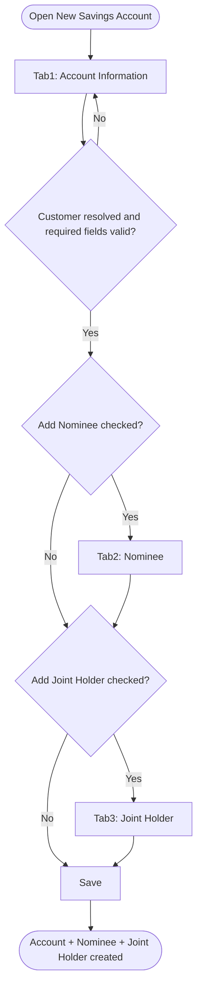
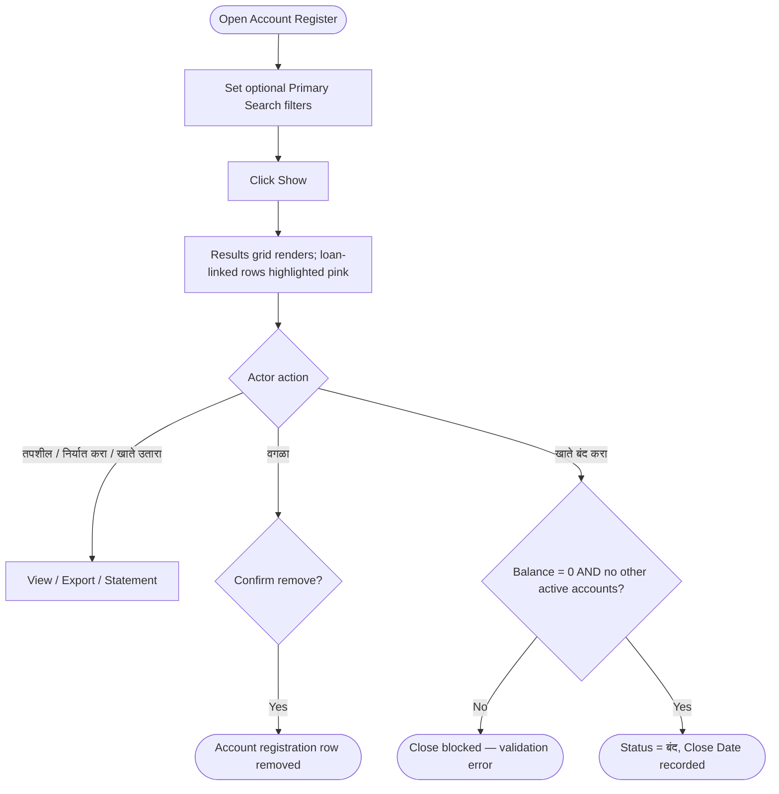

# Workflows — Savings

## Purpose

Step-by-step process flows for Savings module operations. Workflows reference business rules and use cases.

---

### WF-001 — New Savings Account wizard

| Property | Value |
| :--- | :--- |
| Trigger | Actor opens New Savings Account |
| Outcome | Account + Nominee(s) + Joint Holder(s) persisted |
| Use case | [UC-001](use-cases.md#uc-001--open-a-new-savings-account) |

**Steps:**

1. **Tab 1 — Account Information:** Resolve Customer via Autocomplete ([BR-001](business-rules.md#br-001--customer-must-exist-before-savings-account-can-be-opened)); select Scheme ([BR-002](business-rules.md#br-002--scheme-required-and-loaded-from-savings-scheme-master)) — Interest Rate auto-fills ([BR-005](business-rules.md#br-005--interest-rate-auto-filled-from-scheme-admin-override-role-undefined)); enter Current Date ([BR-006](business-rules.md#br-006--current-date-defaults-to-system-date)), Minimum Balance ([BR-007](business-rules.md#br-007--minimum-balance-required-at-opening)), Status ([BR-008](business-rules.md#br-008--account-status-default-and-shared-values-across-deposit-products)); optionally expand Advanced Settings ([BR-009](business-rules.md#br-009--advanced-settings-visibility-role-undefined)–[BR-011](business-rules.md#br-011--ifsc-code-enables-bank-payout-auto-fill)); optionally check Add Nominee / Add Joint Holder ([BR-012](business-rules.md#br-012--nominee-section-conditional-on-add-nominee-checkbox), [BR-013](business-rules.md#br-013--joint-holder-section-conditional-on-add-joint-holder-checkbox)).
2. **Tab 2 — Nominee (if enabled):** Resolve nominee Customer or quick-add ([BR-014](business-rules.md#br-014--nominee-lookup-resolves-to-existing-or-quick-added-customer)); select Relation from canonical list ([BR-015](business-rules.md#br-015--nominee-relation-reuses-canonical-membership-list)); Percentage optional, Nomination Date and Age system-derived ([BR-016](business-rules.md#br-016--nominee-percentage-optional-nomination-date-and-age-system-derived)); Add to grid.
3. **Tab 3 — Joint Holder (if enabled):** Optionally check Guardian; resolve joint holder Customer; Add validates selection before appending to grid ([BR-017](business-rules.md#br-017--joint-holder-guardian-and-customer-fields-add-validates-selection)); select Account Operation Instructions ([BR-018](business-rules.md#br-018--account-operation-instructions-required-with-defined-values)).
4. **Save:** Validate all visible tabs; persist Account, Nominee(s), Joint Holder(s) atomically only on this final action ([BR-019](business-rules.md#br-019--new-savings-account-wizard-atomic-save-on-create)). Next/Back never persist partial records.

**Exceptions:**
- Validation failure on any visible tab blocks Next or Save with a field-level error.
- Customer not found on Tab 1 blocks the wizard entirely — actor must complete New Customer registration first.
- Reset clears all tab state without persisting.

**Referenced Rules:** BR-001 through BR-019

---

### WF-002 — Savings account search, removal, and closure

| Property | Value |
| :--- | :--- |
| Trigger | Actor opens Account Register, optionally with filters |
| Outcome | Filtered results rendered; selected account removed or closed |
| Use case | [UC-002](use-cases.md#uc-002--search-view-and-maintain-savings-accounts-via-account-register) |

**Steps:**

1. Actor optionally sets any combination of Branch, Scheme, Status, Account No. range, Account Holder, Customer No. range, and Loan-linked accounts filter ([BR-021](business-rules.md#br-021--account-register-primary-search-fields-all-optional), [BR-022](business-rules.md#br-022--loan-linked-accounts-filter-depends-on-undocumented-loan-domain)).
2. Actor clicks Show ([BR-023](business-rules.md#br-023--account-register-grid-and-search-follow-interactive-reporting-standard)); grid renders with pagination and totals; loan-linked accounts render pink.
3. **View path:** Actor clicks तपशील, निर्यात करा, or खाते उतारा for the selected row ([BR-026](business-rules.md#br-026--account-details-and-account-statement-lack-dedicated-specs), TODO on underlying screens/reports).
4. **Remove path:** Actor clicks वगळा; system treats this as Remove ([BR-024](business-rules.md#br-024--वगळा-exclude-is-equivalent-to-काढा-remove)) and deletes the selected account registration row.
5. **Close path:** Actor clicks खाते बंद करा; system checks account balance = 0 and confirms the customer has no other active Loan/Daily/Recurring/FD accounts ([BR-025](business-rules.md#br-025--close-account-requires-zero-balance-and-no-other-active-bank-relationships)); on success, Status is set to `बंद` and Account Close Date is recorded; on failure, a validation error names the unmet condition.

**Exceptions:**
- No matches renders an empty grid state, not an error.
- Close Account is blocked when either precondition in [BR-025](business-rules.md#br-025--close-account-requires-zero-balance-and-no-other-active-bank-relationships) fails.
- Remove behaviour on accounts with posted transaction history is `TODO:` unresolved ([BR-024](business-rules.md#br-024--वगळा-exclude-is-equivalent-to-काढा-remove) Notes).

**Referenced Rules:** BR-020 through BR-026

---

### Permission enforcement (cross-cutting)

Applies identically to both Savings screens. Not duplicated here — see [settings/master/workflows.md WF-003](../settings/master/workflows.md#wf-003--permission-enforcement-at-runtime) and [BR-020](business-rules.md#br-020--savings-screens-use-master-permission-levels).

---

## Related Documents

- [overview.md](overview.md)
- [business-rules.md](business-rules.md)
- [use-cases.md](use-cases.md)
- [acceptance-tests.md](acceptance-tests.md)
- [../settings/master/workflows.md](../settings/master/workflows.md)
