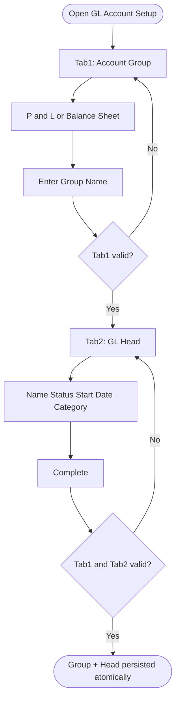

# Workflows — Settings / Accounting

## Purpose

Step-by-step process flows for GL Account Setup. Workflows reference business rules and use cases.

---

### WF-001 — GL Account Setup create wizard

| Property | Value |
| :--- | :--- |
| Trigger | Administrator opens GL Account Setup |
| Outcome | New GL Group + new GL Head persisted together |
| Use case | [UC-001](use-cases.md#uc-001--create-gl-group-and-gl-head) |

**Steps:**

1. **Tab 1 — Account Group:** Select P&L or Balance Sheet ([BR-003](business-rules.md#br-003--primary-group-pnl-or-balance-sheet)); show Income/Expense or Receivable/Payable ([BR-004](business-rules.md#br-004--pnl-income-or-expense-visibility), [BR-005](business-rules.md#br-005--balance-sheet-receivable-or-payable-visibility)); Group Type = Other ([BR-006](business-rules.md#br-006--group-type-fixed-to-other)); enter Group Name ([BR-007](business-rules.md#br-007--group-name-required), [BR-008](business-rules.md#br-008--group-name-unique-within-tenant)).
2. **Next:** Advance without persist ([BR-002](business-rules.md#br-002--gl-setup-atomic-save-on-create)).
3. **Tab 2 — GL Head:** Read-only group label ([BR-009](business-rules.md#br-009--tab-2-account-group-readonly-from-tab-1)); auto GL Head No. ([BR-010](business-rules.md#br-010--gl-head-number-auto-generated)); Account Type Other ([BR-011](business-rules.md#br-011--account-type-fixed-to-other)); Name / Status / Start Date ([BR-012](business-rules.md#br-012--gl-head-name-required)–[BR-015](business-rules.md#br-015--start-date-required)); Balance Type Credit/Debit only ([BR-016](business-rules.md#br-016--balance-type-credit-or-debit-only)); Branch Account gates Org+Branch ([BR-017](business-rules.md#br-017--branch-account-requires-organization-and-branch)); optional Advanced ([BR-018](business-rules.md#br-018--member-like-and-contra-in-advanced)).
4. **Complete:** Create new Group + Head only ([BR-001](business-rules.md#br-001--gl-setup-creates-new-group-and-head)); persist atomically ([BR-002](business-rules.md#br-002--gl-setup-atomic-save-on-create)).

**Exceptions:**
- Validation or uniqueness failure blocks Complete; no partial write.
- Reset clears both tabs without persist ([UC-002](use-cases.md#uc-002--reset-gl-account-setup-without-saving)).

**Referenced Rules:** BR-001 through BR-019

---

### WF-002 — P&L vs Balance Sheet classification switch

| Property | Value |
| :--- | :--- |
| Trigger | Actor switches between Profit & Loss and Balance Sheet on Tab 1 |
| Outcome | Correct secondary radios shown; opposite pair hidden |
| Use case | [UC-001](use-cases.md#uc-001--create-gl-group-and-gl-head) A1 |

**Steps:**
1. Actor selects Balance Sheet ([BR-003](business-rules.md#br-003--primary-group-pnl-or-balance-sheet)).
2. System hides Income/Expense and shows Receivable/Payable ([BR-005](business-rules.md#br-005--balance-sheet-receivable-or-payable-visibility)).
3. Actor selects Profit & Loss — system hides Receivable/Payable and shows Income/Expense with Income default ([BR-004](business-rules.md#br-004--pnl-income-or-expense-visibility)).

**Exceptions:**
- None.

**Referenced Rules:** BR-003, BR-004, BR-005

---

## Related Documents

- [overview.md](overview.md)
- [business-rules.md](business-rules.md)
- [use-cases.md](use-cases.md)
- [acceptance-tests.md](acceptance-tests.md)
- [../../05-ui-ux/settings/accounting/gl-account-setup-screen.md](../../05-ui-ux/settings/accounting/gl-account-setup-screen.md)
