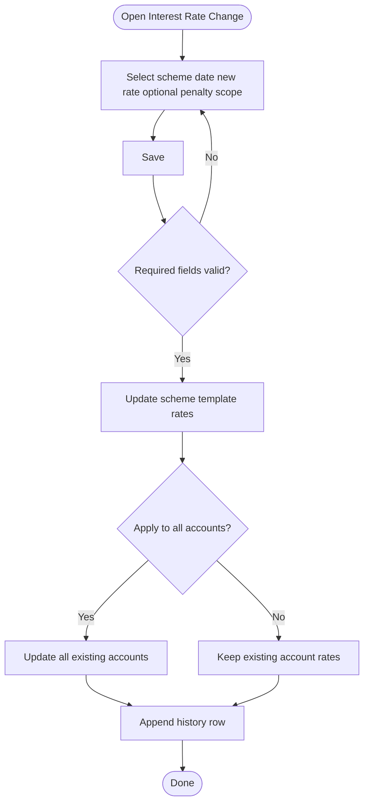

# Workflows — Settings / Loan

## Purpose

Step-by-step process flows for Loan Interest Rate Change.

---

### WF-001 — Loan scheme interest rate change

| Property | Value |
| :--- | :--- |
| Trigger | Administrator opens Interest Rate Change and Saves |
| Outcome | Scheme template updated; accounts updated per scope; history row appended |
| Use case | [UC-001](use-cases.md#uc-001--change-loan-scheme-interest-rate) |

**Steps:**

1. Enter Scheme, Change Date, New Interest Rate, optional Penalty, apply scope ([BR-001](business-rules.md#br-001--loan-scheme-required)–[BR-006](business-rules.md#br-006--apply-scope-mutually-exclusive)).
2. Save → always update scheme template ([BR-007](business-rules.md#br-007--scheme-template-always-updated-on-save)).
3. If All Accounts → update existing accounts ([BR-008](business-rules.md#br-008--apply-new-rate-to-all-accounts)); if New Only → leave existing account rates ([BR-009](business-rules.md#br-009--apply-new-rate-to-new-accounts-only)).
4. Append history row ([BR-010](business-rules.md#br-010--rate-change-appends-history-row)).

**Exceptions:**
- Validation failure blocks Save; no template/history change.

**Referenced Rules:** BR-001 through BR-012

---

## Related Documents

- [overview.md](overview.md)
- [business-rules.md](business-rules.md)
- [use-cases.md](use-cases.md)
- [acceptance-tests.md](acceptance-tests.md)
