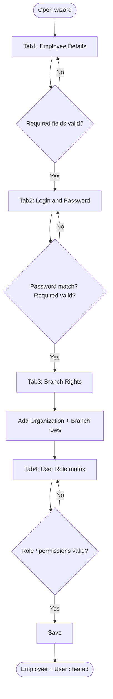

# Workflows — Settings / Master

## Purpose

Step-by-step process flows for Master settings operations. Workflows reference business rules and use cases.

---

### WF-001 — Staff & System Access registration wizard

| Property | Value |
| :--- | :--- |
| Trigger | Administrator opens New Staff & System Access |
| Outcome | Employee + User + branch rights + role permissions persisted |
| Use case | [UC-001](use-cases.md#uc-001--register-staff-and-grant-system-access) |

**Steps:**

1. **Tab 1 — Employee Details:** Select Customer ([BR-001](business-rules.md#br-001--customer-required-for-staff-registration)), Designation ([BR-002](business-rules.md#br-002--designation-required)), Director/Employee type ([BR-003](business-rules.md#br-003--employee-type-director-or-employee)). Set in-service = Yes silently ([BR-004](business-rules.md#br-004--employee-in-service-default-at-creation)).
2. **Tab 2 — Login & Password:** Enter credentials ([BR-005](business-rules.md#br-005--login-name-required), [BR-006](business-rules.md#br-006--password-and-confirm-password-must-match), [BR-010](business-rules.md#br-010--login-name-uniqueness), [BR-011](business-rules.md#br-011--password-complexity)), Status ([BR-007](business-rules.md#br-007--user-status-required-with-defined-values)), optional Super User ([BR-012](business-rules.md#br-012--super-user-permission-bypass)). Persist User Type = Society ([BR-008](business-rules.md#br-008--user-type-defaults-to-society)). Optional Advanced limits ([BR-009](business-rules.md#br-009--intra-branch-limits-conditional-on-checkbox)).
3. **Tab 3 — Branch Rights:** For each access grant, select Organization + Branch ([BR-013](business-rules.md#br-013--organization-and-branch-required-for-rights-row)), Add to grid. At least one row required; single-branch tenants auto-receive that branch ([BR-018](business-rules.md#br-018--minimum-branch-rights-on-save)).
4. **Tab 4 — User Role:** Select existing Role (or create+assign) per [BR-020](business-rules.md#br-020--staff-access-assigns-existing-role) and [WF-002](#wf-002--user-role-permission-assignment).
5. **Save:** On create, validate all tabs and persist atomically only on final Save ([BR-019](business-rules.md#br-019--staff-access-wizard-atomic-save-on-create)). Next/Back do not persist.

**Exceptions:**
- Validation failure on any tab blocks Next or Save with field-level error.
- Reset clears current wizard state on all tabs.

**Referenced Rules:** BR-001 through BR-020

---

### WF-002 — User Role permission assignment

| Property | Value |
| :--- | :--- |
| Trigger | Administrator opens User Role screen or reaches Tab 4 of WF-001 |
| Outcome | Role with per-form permissions persisted |
| Use case | [UC-002](use-cases.md#uc-002--define-user-role-permission-template) |

**Steps:**
1. Enter Role name ([BR-014](business-rules.md#br-014--role-name-required)).
2. System loads all forms from menu registry ([BR-015](business-rules.md#br-015--permission-grid-loaded-from-menu-registry)).
3. For each form row, assign one permission level ([BR-016](business-rules.md#br-016--exactly-one-permission-level-per-form-row), [BR-017](business-rules.md#br-017--permission-levels-are-all-rights--view-only--no-rights)).
4. Save Role.

**Exceptions:**
- Empty Role name blocks save.
- Conflicting permission selections on a row are resolved to a single level before save.

**Referenced Rules:** BR-014, BR-015, BR-016, BR-017

---

### WF-003 — Permission enforcement at runtime

| Property | Value |
| :--- | :--- |
| Trigger | User navigates to any application form after login |
| Outcome | Form rendered per effective permission level |
| Use case | Cross-cutting — all modules |

**Steps:**
1. User authenticates; JWT includes `tenant_id` (architecture DEC-001).
2. System resolves User's assigned Role(s) and effective permission per target form code.
3. If Super User flag is set — apply [BR-012](business-rules.md#br-012--super-user-permission-bypass): effective permission is All Rights on every form; then apply branch-rights scope.
4. Else apply Role permission level:
   - **All Rights:** full form and actions enabled.
   - **View Only:** all fields read-only; mutation actions hidden.
   - **No Rights:** route guard redirects or blocks navigation.

**Exceptions:**
- Unregistered or missing-permission `form_code` — treat as No Rights ([BR-023](business-rules.md#br-023--unregistered-form-defaults-to-no-rights)); do not fail app startup in Year 1.

**Referenced Rules:** BR-012, BR-017, BR-023

---

## Related Documents

- [overview.md](overview.md)
- [business-rules.md](business-rules.md)
- [use-cases.md](use-cases.md)
- [acceptance-tests.md](acceptance-tests.md)
- [../../01-architecture/architecture-overview.md](../../01-architecture/architecture-overview.md)
