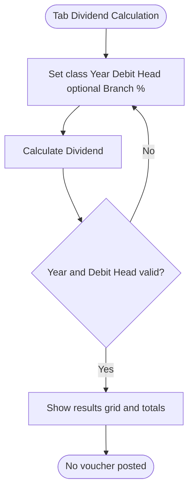

# Workflows — Settings / Membership

## Purpose

Step-by-step process flows for Membership Configuration.

---

### WF-001 — Share rule maintain

| Property | Value |
| :--- | :--- |
| Trigger | Administrator opens Share Rules tab |
| Outcome | Share-rule grid row created or removed |
| Use case | [UC-001](use-cases.md#uc-001--save-or-remove-share-rules) |

**Steps:**
1. Select Member class ([BR-001](business-rules.md#br-001--member-class-filter-mutually-exclusive)).
2. Enter required fields ([BR-002](business-rules.md#br-002--share-rule-required-fields)).
3. Save → uniqueness check ([BR-003](business-rules.md#br-003--share-series-unique-within-member-class)) → persist grid row ([BR-004](business-rules.md#br-004--share-rule-save-persists-grid-row)).
4. Optional: select rows → Remove ([BR-005](business-rules.md#br-005--share-rule-remove-deletes-selected-rows)).

**Exceptions:**
- Validation or duplicate series blocks Save.

**Referenced Rules:** BR-001–BR-006, BR-013

---

### WF-002 — Dividend calculation preview

| Property | Value |
| :--- | :--- |
| Trigger | Administrator clicks Calculate Dividend |
| Outcome | Preview grid + totals displayed; no posting |
| Use case | [UC-002](use-cases.md#uc-002--preview-dividend-calculation) |

**Steps:**

1. Apply filters ([BR-007](business-rules.md#br-007--dividend-year-required)–[BR-010](business-rules.md#br-010--dividend-percentage-optional)).
2. Calculate → preview only ([BR-011](business-rules.md#br-011--dividend-calculate-is-preview-only)).
3. Read-only settings labels remain display-only ([BR-012](business-rules.md#br-012--dividend-settings-labels-read-only)).

**Exceptions:**
- Missing required filters block Calculate.

**Referenced Rules:** BR-001, BR-007–BR-013

---

## Related Documents

- [overview.md](overview.md)
- [business-rules.md](business-rules.md)
- [use-cases.md](use-cases.md)
- [acceptance-tests.md](acceptance-tests.md)
