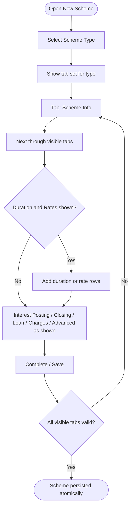

# Workflows — Settings / Schemes

## Purpose

Step-by-step process flows for scheme configuration. Workflows reference business rules and use cases.

---

### WF-001 — New Scheme create wizard

| Property | Value |
| :--- | :--- |
| Trigger | Administrator opens New Scheme |
| Outcome | Scheme + related grids persisted |
| Use case | [UC-001](use-cases.md#uc-001--create-product-scheme) |

**Steps:**

1. **Select Scheme Type** ([BR-001](business-rules.md#br-001--scheme-type-required)). Changing type resets wizard ([BR-002](business-rules.md#br-002--scheme-type-change-resets-wizard)) and applies tab matrix ([BR-003](business-rules.md#br-003--tab-visibility-by-scheme-type)).
2. **Scheme Info:** GL Head ([BR-004](business-rules.md#br-004--gl-head-required-from-gl-master), [BR-005](business-rules.md#br-005--daily-scheme-gl-head-number--99), [BR-006](business-rules.md#br-006--multiple-schemes-may-share-one-gl-head)), Name ([BR-007](business-rules.md#br-007--scheme-name-required), [BR-008](business-rules.md#br-008--scheme-name-unique-within-scheme-type)), Status ([BR-009](business-rules.md#br-009--scheme-status-required-with-defined-values)), optional Members-only ([BR-010](business-rules.md#br-010--allow-only-members-optional)), plus type-specific fields.
3. **Duration & Rates** (Daily/FD/Recurring/Loan): add rows with type-required columns ([BR-020](business-rules.md#br-020--duration-and-rates-row-required-fields), [BR-025](business-rules.md#br-025--recurring-duration-row-includes-agent-rate), [BR-030](business-rules.md#br-030--loan-duration-row-required-fields)).
4. **Interest Posting** (all types): optional add of day (1–31) + month ([BR-011](business-rules.md#br-011--interest-posting-day-and-month-on-add)).
5. **Account Closing** (Daily/FD/Recurring only) ([BR-021](business-rules.md#br-021--account-closing-tab-deposit-types-only)).
6. **Charges** (all types) with shared names ([BR-012](business-rules.md#br-012--shared-charge-types)); Loan uses Deduction/Fee mode ([BR-032](business-rules.md#br-032--loan-charges-deduction-or-fee-mode)).
7. **Loan Specific** (Loan only): Guarantor + Gold/Deposit Security ([BR-031](business-rules.md#br-031--loan-guarantor-total-is-sum)).
8. **Advanced** (FD/Recurring/Loan): collapsed by default; FD auto-renewal dependents ([BR-023](business-rules.md#br-023--fd-auto-renewal-dependent-fields)); Recurring salary/rebate ([BR-026](business-rules.md#br-026--recurring-salary-and-rebate-under-advanced)).
9. **Save:** Persist only on final Complete/Save ([BR-013](business-rules.md#br-013--scheme-wizard-atomic-save-on-create)).

**Exceptions:**
- Validation failure blocks Next or Save.
- Reset clears wizard without persist ([UC-002](use-cases.md#uc-002--reset-scheme-wizard-without-saving)).

**Referenced Rules:** BR-001 through BR-032

---

### WF-002 — Scheme Type switch mid-wizard

| Property | Value |
| :--- | :--- |
| Trigger | Actor changes Scheme Type dropdown while wizard has data |
| Outcome | Wizard returns to Tab 1 with new tab set; prior type draft discarded |
| Use case | [UC-001](use-cases.md#uc-001--create-product-scheme) A1 |

**Steps:**
1. Actor changes Scheme Type.
2. System discards in-memory values for the previous type ([BR-002](business-rules.md#br-002--scheme-type-change-resets-wizard)).
3. System shows Tab 1 and the new tab visibility set ([BR-003](business-rules.md#br-003--tab-visibility-by-scheme-type)).
4. No database write occurs until later Save ([BR-013](business-rules.md#br-013--scheme-wizard-atomic-save-on-create)).

**Exceptions:**
- None beyond standard validation on the new type’s fields.

**Referenced Rules:** BR-001, BR-002, BR-003, BR-013

---

## Related Documents

- [overview.md](overview.md)
- [business-rules.md](business-rules.md)
- [use-cases.md](use-cases.md)
- [acceptance-tests.md](acceptance-tests.md)
- [../../05-ui-ux/settings/schemes/new-scheme-screen.md](../../05-ui-ux/settings/schemes/new-scheme-screen.md)
