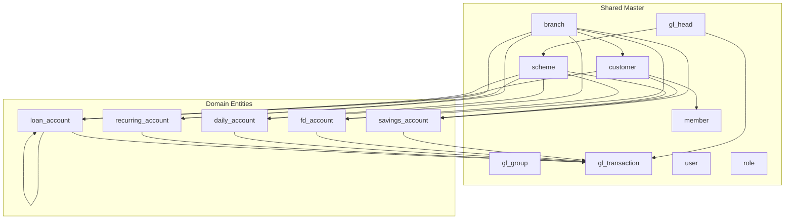

# Database Design — Overview

## Purpose

Master index for CBS SaaS platform database entity documentation. Tracks design status per domain and links to shared master entities, standards, and report traceability.

**Status:** Not started — no domain entity files authored yet. Use `@design-database-schema <domain>` to begin.

## Standards & Cross-Cutting Docs

| Document | Purpose |
| :--- | :--- |
| [database-design-standards.md](database-design-standards.md) | Naming, types, multi-tenancy, ledger pattern, constraints, indexes |
| [reports-traceability.md](reports-traceability.md) | Maps each report spec to required entities/columns |

## Shared Master Entities

Defined once under `shared/`, referenced by FK from all domains. **Status: Not started.**

| Entity | UI Source | Status |
| :--- | :--- | :--- |
| `branch` | entity-autocomplete-pattern, all modules | Not Started |
| `organization` | Session header, membership/GL screens | Not Started |
| `gl_group` | GL Account Setup | Not Started |
| `gl_head` | GL Account Setup, schemes, accounting | Not Started |
| `customer` | Customer module | Not Started |
| `member` | Membership module | Not Started |
| `agent` | Daily module | Not Started |
| `bank` | Bank Management | Not Started |
| `employee` | Staff System Access | Not Started |
| `user` | Staff System Access | Not Started |
| `role` | User Role | Not Started |
| `scheme` | New Scheme (unified) | Not Started |
| `gl_transaction` | Accounting + all product transactions | Not Started |
| `nominee` | Nominee tabs (Savings/FD/Daily/Recurring/Customer) | Not Started |
| `address` | New Customer, membership | Not Started |
| `kyc_document` | New Customer Tab 3 | Not Started |

## Domain Entity Status

Recommended build order (matches `cbs-project-execution-plan.md` Phase 3 dependency graph):

| Order | Domain | Path | UI Module | DB Status | Key Entities (planned) |
| :---: | :--- | :--- | :--- | :--- | :--- |
| 0 | Shared / Foundation | `shared/` | Settings, Auth | Not Started | branch, organization, gl_group, gl_head, user, role, employee, scheme, gl_transaction |
| 1 | Customer & Membership | `customer/`, `membership/` | Customer, Membership | Not Started | customer, address, kyc_document, member, share_account |
| 2 | Savings | `savings/` | Savings | Not Started | savings_account, savings_transaction |
| 3 | Fixed Deposit | `fixed-deposit/` | Fixed Deposit | Not Started | fd_account, fd_transaction, deposit_loan |
| 4 | Daily (Pigmy) | `daily/` | Daily | Not Started | daily_account, agent, agent_collection |
| 5 | Recurring | `recurring/` | Recurring | Not Started | recurring_account, recurring_transaction |
| 6 | Loan | `loan/` | Loan | Not Started | loan_account, loan_installment, loan_transaction, guarantor |
| 7 | Accounting | `accounting/` | Accounting | Not Started | (posts to shared gl_transaction) |
| 8 | Bank / Investment | `bank/`, `investment/` | Bank, Investment | Not Started | bank, bank_deposit_account |
| 9 | Reports | — | Reports | Not Started | Read-only aggregates — no separate tables unless materialized views documented |

## Domain Dependency Diagram

## How to Add a Domain

1. Invoke `@design-database-schema <domain>` (e.g. `customer`, `loan`, `shared`).
2. Skill reads UI specs + mockups, checks shared entities for reuse, asks questions for unknowns.
3. Creates/updates `04-database-design/<domain>/` entity files + `changelog.md`.
4. Updates this overview (status column), `AI_INDEX.md`, and `reports-traceability.md`.

## Phase Alignment

| Phase | Database work |
| :--- | :--- |
| Phase 1 §1.8 | Seed shared + Customer/Auth entities (this folder) |
| Phase 2 | NestJS entities/migrations from these docs |
| Phase 3 | Repeat per-domain checklist item 3 |
| Phase 4 | Report materialized views if needed (document here first) |

## Related Documents

- [database-design-standards.md](database-design-standards.md)
- [reports-traceability.md](reports-traceability.md)
- [../cbs-project-execution-plan.md](../cbs-project-execution-plan.md)
- [../AI_INDEX.md](../AI_INDEX.md)
- [../../.cursor/skills/design-database-schema/SKILL.md](../../.cursor/skills/design-database-schema/SKILL.md)
