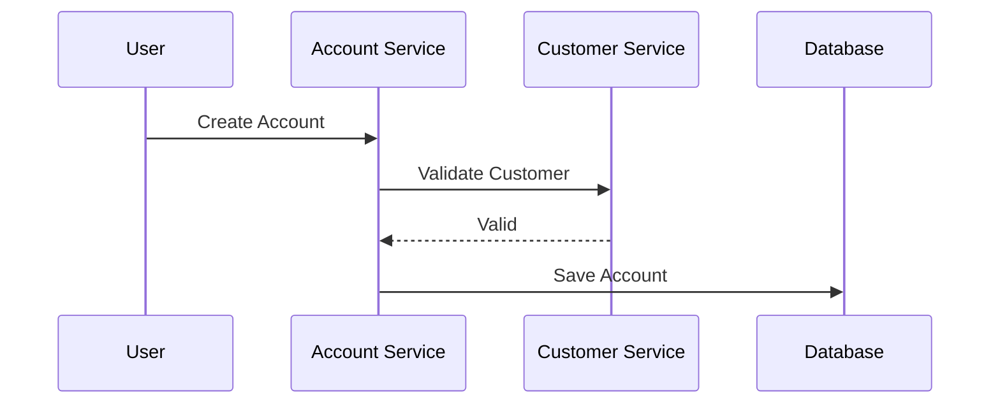

# Document Generation Guide for AI Agents

## Purpose

This document defines the rules and standards that an AI Agent must follow when generating, updating, or maintaining project documentation.

The objective is to create documentation that is:

* Modular
* Maintainable
* Human-readable
* AI-friendly
* Version-controlled
* Cross-linked
* Suitable for large enterprise systems

Examples include:

* Core Banking Systems
* ERP Systems
* CRM Platforms
* Insurance Platforms
* Hospital Management Systems
* Trading Platforms

---

# Primary Objective

The AI Agent must never create a single large document containing all requirements.

Documentation must be split into small focused markdown files organized by domain and responsibility.

Each document should have a single purpose.

---

# Documentation Structure

The project must follow the structure below.

```text
project-root/

├── AI_INDEX.md

├── 00-project-overview/
│   ├── vision.md
│   ├── business-goals.md
│   ├── glossary.md
│   └── system-boundaries.md
│
├── 01-architecture/
│   ├── architecture-overview.md
│   ├── domain-driven-design.md
│   ├── microservices.md
│   ├── security-architecture.md
│   └── technology-stack.md
│
├── 02-business-domains/
│   ├── customer-management/
│   ├── accounts/
│   ├── deposits/
│   ├── loans/
│   ├── transactions/
│   ├── payments/
│   ├── reporting/
│   └── notifications/
│
├── 03-api-contracts/
│
├── 04-database-design/
│
├── 05-ui-ux/
│
├── 06-non-functional/
│
├── 07-compliance/
│
├── 08-testing/
│
└── 09-ai-context/
```

---

# Document Creation Rules

## Rule DOC-001

One document must have one responsibility.

Bad Example:

* Accounts + Transactions + Loans in one document

Good Example:

* accounts/overview.md
* accounts/business-rules.md
* accounts/use-cases.md

---

## Rule DOC-002

Maximum document size:

* Preferred: 200–500 lines
* Hard Limit: 700 lines

If document exceeds 700 lines:

Split into smaller documents.

---

## Rule DOC-003

Every markdown file must contain:

```markdown
# Title

## Purpose

## Scope

## Dependencies

## Content
```

---

# AI Read Order

Before generating any code or documentation the AI Agent must read documents in the following order.

1. AI_INDEX.md
2. vision.md
3. glossary.md
4. architecture-overview.md
5. domain-driven-design.md
6. Relevant module documents
7. coding-standards.md
8. generation-rules.md

The AI Agent must never skip this sequence.

---

# Module Documentation Standard

Every business domain folder must contain:

```text
module-name/

├── overview.md
├── business-rules.md
├── use-cases.md
├── workflows.md
├── api-contracts.md
├── database.md
├── sequence-diagrams.md
├── acceptance-tests.md
└── changelog.md
```

---

# UI Field Type Standards

Screen specs under `05-ui-ux/` use a standard **Autocomplete** field type for Branch, GL Head, and Account Holder lookup.

| Spec Type | Use for | Reference |
| :--- | :--- | :--- |
| `Autocomplete` | Single control: user types ID or name, presses Enter, field shows `id — name` | [05-ui-ux/shared/entity-autocomplete-pattern.md](05-ui-ux/shared/entity-autocomplete-pattern.md) |

**Rule:** Do not author legacy ID + select (or ID + search + select) pairs for Branch, GL, or Account Holder in new or updated screen specs. Merge into one Autocomplete row per entity.

---

# Overview Document Template

Each module must contain:

```markdown
# Module Overview

## Purpose

Describe why the module exists.

## Responsibilities

List module responsibilities.

## Features

List supported features.

## Dependencies

List dependent modules.

## Owned Entities

List entities owned by this module.
```

---

# Business Rules Standard

Business rules must use identifiers.

Format:

```text
BR-001
BR-002
BR-003
```

Example:

```text
BR-001

Savings Account Minimum Balance = 1000 INR

BR-002

Frozen Account Cannot Perform Debit Transactions
```

Never use ambiguous language.

Avoid:

* Usually
* Sometimes
* Generally
* May be

Use explicit rules.

---

# Use Case Standard

Each use case must follow:

```markdown
UC-001

Title

Actors

Preconditions

Main Flow

Alternative Flow

Exception Flow

Post Conditions

Business Rules Referenced
```

---

# API Contract Standard

Each endpoint must be documented separately.

Example:

```text
03-api-contracts/

accounts/

POST-create-account.md

GET-account-details.md

PUT-freeze-account.md
```

Each API document must contain:

```markdown
Endpoint

Method

Request

Response

Validation Rules

Error Codes

Dependencies

Acceptance Criteria
```

---

# Database Documentation Standard

One aggregate/entity per document.

Example:

```text
customer-entity.md

account-entity.md

transaction-entity.md
```

Each document must contain:

```markdown
Entity Name

Description

Fields

Indexes

Relationships

Constraints

Business Rules
```

---

# Acceptance Test Standard

Format:

```markdown
AT-001

Given

When

Then

And
```

Example:

```markdown
Given Customer Exists

When Savings Account Is Created

Then Account Is Active
```

Acceptance tests must be implementation independent.

---

# Sequence Diagram Standard

Use Mermaid whenever possible.

Example:



---

# Cross-Linking Rules

Every document must reference related documents.

Use markdown links.

Example:

```markdown
Related Documents

- ../customer-management/overview.md
- ../transactions/business-rules.md
```

Dependencies must always be documented.

---

# Glossary Rules

Every business term must be defined once.

Examples:

* Customer
* Account
* Loan
* Ledger
* Transaction
* Interest

The AI Agent must reuse glossary definitions and never redefine terms differently.

---

# Architecture Documentation Rules

Architecture documents must describe:

* System Architecture
* Service Boundaries
* Communication Patterns
* Security Model
* Deployment Model
* Event Flows

Architecture documents must not contain implementation code.

---

# Non-Functional Requirement Rules

Create separate documents.

Example:

```text
security.md

performance.md

availability.md

audit.md

monitoring.md
```

Requirements must use identifiers.

```text
SEC-001

All APIs Require JWT Authentication

PERF-001

Balance Inquiry Response Time < 200ms
```

---

# Compliance Documentation Rules

Separate compliance concerns.

Examples:

```text
RBI Compliance

GDPR Compliance

Audit Requirements

Data Retention Rules

KYC Requirements
```

---

# AI Context Folder

Folder:

```text
09-ai-context/
```

Must contain:

```text
coding-standards.md

generation-rules.md

folder-structure.md

naming-conventions.md

technology-stack.md
```

These documents are considered mandatory context.

---

# Naming Convention Rules

Files:

```text
lowercase-with-hyphen.md
```

Examples:

```text
account-overview.md

business-rules.md

loan-approval-workflow.md
```

Avoid:

```text
AccountOverview.md

AccountOverviewFinal.md

NewDocument.md
```

---

# Change Management Rules

Every module must contain:

```text
changelog.md
```

Format:

```markdown
Version

Date

Changes

Reason

Author
```

---

# AI Generation Constraints

The AI Agent must:

1. Never invent business rules.
2. Never create undocumented entities.
3. Never generate APIs without related use cases.
4. Never generate database tables without business ownership.
5. Never generate code before reading documentation.
6. Never duplicate definitions.
7. Always reference existing glossary definitions.
8. Always create acceptance tests.
9. Always maintain document links.
10. Always update changelog when modifying documentation.

---

# AI Output Quality Checklist

Before completing any documentation task verify:

* Document follows folder structure
* Links are valid
* Rules have identifiers
* Use cases are complete
* Acceptance tests exist
* Dependencies documented
* Glossary references used
* Changelog updated
* No duplicated information
* File size within limits

If any item fails, regenerate or update the documentation before marking the task complete.
