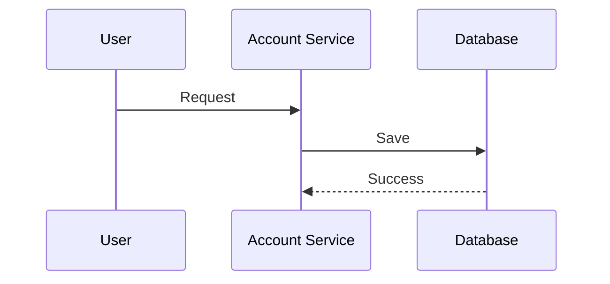

# Software Documentation Standard

## Overview

This document defines the standard structure, templates, conventions, and best practices for project documentation.

It serves as the single source of truth for both developers and AI agents.

---

# Documentation Philosophy

Documentation should be:

* Modular
* Explicit
* Version Controlled
* Human Readable
* AI Friendly

The objective is to create documentation that can be consumed by both humans and AI coding systems.

---

# Project Structure

```text
project-root/

AI_INDEX.md

00-project-overview/

01-architecture/

02-business-domains/

03-api-contracts/

04-database-design/

05-ui-ux/

06-non-functional/

07-compliance/

08-testing/

09-ai-context/
```

---

# AI_INDEX.md

Purpose:

Defines reading order for AI systems.

Example:

```text
1. vision.md

2. glossary.md

3. architecture-overview.md

4. domain-driven-design.md

5. module documents

6. coding-standards.md
```

---

# Business Domain Structure

Example:

```text
accounts/

overview.md

business-rules.md

use-cases.md

workflows.md

api-contracts.md

database.md

sequence-diagrams.md

acceptance-tests.md

changelog.md
```

---

# Overview Template

```markdown
# Module Name

## Purpose

## Scope

## Responsibilities

## Features

## Dependencies

## Owned Entities

## Related Documents
```

---

# Business Rule Template

```markdown
# Business Rules

BR-001

Description

BR-002

Description
```

---

# Use Case Template

```markdown
UC-001

Title

Actors

Preconditions

Main Flow

Alternative Flow

Exception Flow

Post Conditions

Referenced Rules
```

---

# Workflow Template

```markdown
Workflow Name

Purpose

Trigger

Steps

Exceptions

Outcome
```

---

# API Template

```markdown
Endpoint

Method

Purpose

Request

Response

Validation Rules

Error Codes

Dependencies

Acceptance Criteria
```

---

# Database Template

```markdown
Entity

Purpose

Fields

Indexes

Relationships

Constraints

Business Rules
```

---

# Acceptance Test Template

```markdown
AT-001

Given

When

Then

And
```

---

# Non-Functional Requirements

Use identifiers.

Examples:

```text
SEC-001

PERF-001

AVAIL-001

AUDIT-001
```

---

# Mermaid Diagrams

Preferred format:



---

# Naming Conventions

File names:

```text
lowercase-with-hyphen.md
```

Examples:

```text
business-rules.md

loan-approval-workflow.md

customer-onboarding.md
```

Avoid:

```text
BusinessRules.md

FinalVersion.md

NewFile.md
```

---

# Document Linking

Use relative links.

Example:

```markdown
## Related Documents

- ../customer-management/overview.md
- ../transactions/business-rules.md
```

---

# Versioning

Every module must contain:

```text
changelog.md
```

Format:

```markdown
Version

Date

Changes

Author

Reason
```

---

# AI Context Documents

Required:

```text
09-ai-context/

coding-standards.md

generation-rules.md

technology-stack.md

folder-structure.md

naming-conventions.md
```

Purpose:

Provide coding guidance for AI agents.

---

# Document Size Guidelines

| Type           | Recommended     |
| -------------- | --------------- |
| Vision         | 1-3 pages       |
| Overview       | <5 pages        |
| Business Rules | 20-50 rules     |
| Use Cases      | 10-20 use cases |
| API Files      | One endpoint    |
| Entity Files   | One entity      |
| AI Context     | <10 pages       |

Maximum size:

700 lines per document.

---

# Quality Standards

Every document must:

* Have a clear purpose
* Use explicit language
* Be linked to related documents
* Follow naming conventions
* Include identifiers where applicable
* Avoid duplicated information

---

# Definition of Done

Documentation is complete only when:

* Structure is correct
* Cross-links exist
* Business rules are numbered
* Use cases are complete
* Acceptance tests exist
* Changelog updated
* Dependencies documented
* AI can generate implementation without clarification
