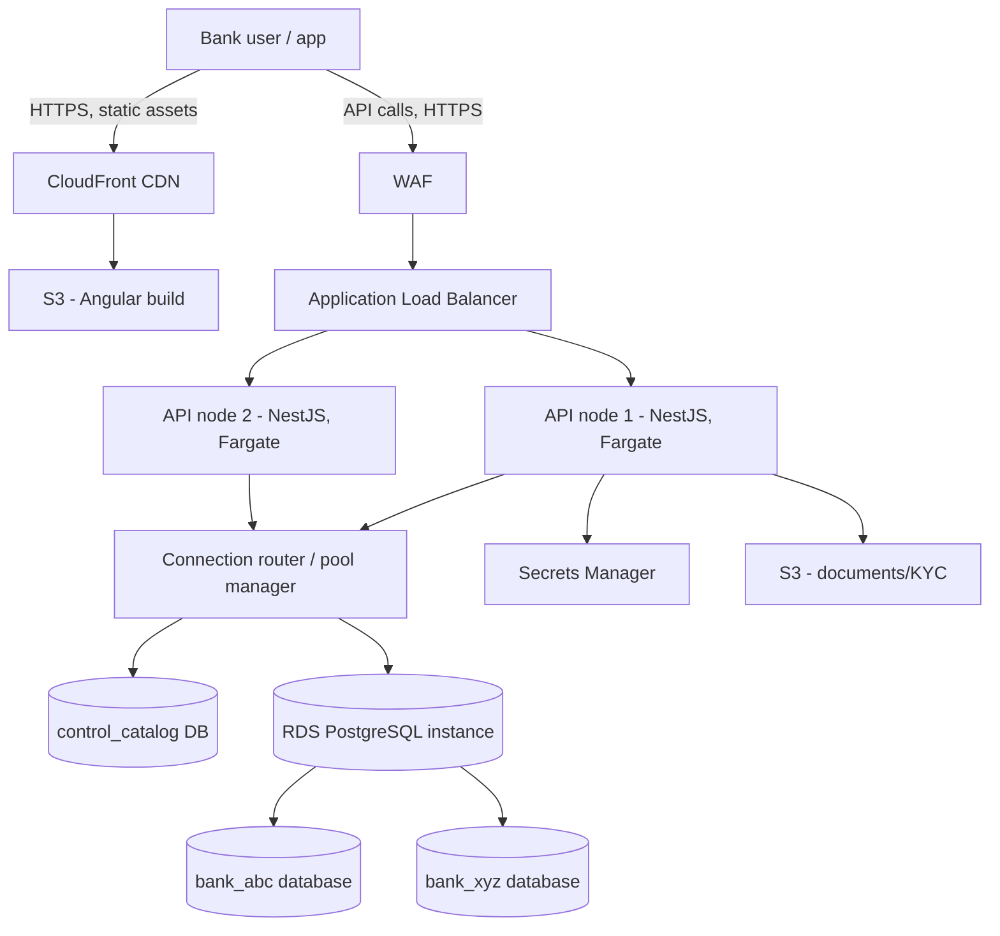
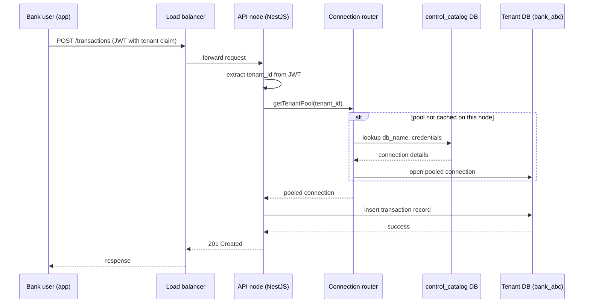

# Architecture Overview — CBS SaaS Infrastructure (ARCH-001)

Status: Draft for discussion. Covers multi-tenancy approach, request flow, AWS service mapping, and cost-efficiency decisions for the cooperative-bank CBS SaaS platform.

## 1. Scope

This document describes the infrastructure architecture for the multi-tenant core banking SaaS platform: how tenants (cooperative banks) are isolated at the database layer, how API requests are routed to the correct tenant database, which AWS services back each layer, and the cost trade-offs behind each environment decision.

It does not cover business domain logic (Accounts, Loans, Transactions modules) — those will get their own module documentation once domain requirements are defined.

> **Open item:** an earlier architecture decision recorded OCI (`ap-mumbai-1`) as the deployment target. This document evaluates an AWS-based deployment for cost/service comparison. The cloud provider choice is **not yet finalized** — treat the AWS service mapping and costs below as one option under evaluation, not a committed decision, until confirmed.

## 2. Decision log

### DEC-001: Multi-tenancy model

- **Context:** Each cooperative bank's data must be isolated for compliance and audit reasons, and each bank's data migration must be independently scoped.
- **Options considered:**
  1. Single database, shared tables, `tenant_id` column on every row.
  2. One RDS instance, separate PostgreSQL database per tenant.
  3. One RDS instance per tenant.
- **Decision:** Option 2 — one RDS instance hosting a separate PostgreSQL database per cooperative bank.
- **Rationale:** Strong logical isolation (no `tenant_id` filter bugs, independent backup/restore, clean migration boundary per bank) without paying for a dedicated instance per tenant.
- **Trade-off accepted:** Postgres connections are bound to a single database, so the API layer must maintain a separate connection pool per tenant (see Section 4). This adds connection-count management work as tenant count grows (see DEC-002).

### DEC-002: Connection pooling at scale

- **Context:** Each tenant pool consumes several connections; multiplied across API nodes and tenants, this can approach the RDS instance's `max_connections` limit well before traffic actually requires it.
- **Decision:** Start with in-process pooling (one pool per tenant, cached after first use). Introduce **Amazon RDS Proxy** (or self-managed PgBouncer) once tenant count exceeds roughly 10–15, or sooner if connection-count alarms fire.
- **Rationale:** Avoids premature complexity for the pilot phase while having a defined trigger to add pooling infrastructure before it becomes an incident.

### DEC-003: Environment uptime scheduling

- **Context:** Dev/QA and Prod compute both bill by the hour; nightly shutdown was evaluated for both to reduce cost.
- **Decision:** Stop Dev/QA compute and database outside working hours (e.g., 7:00 AM–9:00 PM, weekdays) using a scheduler. **Do not** stop Production compute on a nightly schedule.
- **Rationale:** Dev/QA has no external users and the saving is close to 100% of off-hours compute cost with zero risk. Production serves a banking platform where customers expect 24x7 access (UPI/mobile banking conventions in India are always-on); a nightly outage carries SLA, contractual, and reputational risk that outweighs the partial saving (compute is only one line of the prod bill — storage, NAT, ALB, and WAF keep running regardless of whether compute is stopped). Production cost is instead addressed via DEC-004.

### DEC-004: Production cost optimization (without downtime)

- **Decision:** Use Reserved Instances/Savings Plans (1-year term) on RDS and compute once usage patterns stabilize post-pilot, scheduled scale-down of API node count during low-traffic overnight hours (not a full stop), and Graviton (ARM, `t4g`/`m7g`) instance families instead of Intel equivalents.
- **Rationale:** Each lever reduces cost without an availability window. Combined, expected to offset roughly 40–55% of the on-demand compute cost.

### DEC-005: Dev/QA free-tier minimal-cost profile

- **Context:** The dev/QA environment only needs to validate a 2-tenant setup (functional QA and tenant-migration rehearsal). It has no real customer financial data, no public threat surface, and no performance/HA requirement, so several Production controls can be relaxed to fit the AWS Free Tier (12-month, per new account, per account — not per region).
- **Decision:** Run dev/QA on a free-tier-leaning profile for the first 12 months:
  - **RDS:** `db.t3.micro` / `db.t4g.micro`, Single-AZ, 20 GB storage (free-tier covered). Two PostgreSQL databases (`bank_abc`, `bank_xyz`) on the one micro instance.
  - **API compute:** one EC2 `t3.micro` (750 hrs/mo free) hosting the NestJS container, instead of Fargate (Fargate is **not** free-tier eligible).
  - **NAT Gateway:** **removed** in dev/QA — place the single API node in a public subnet with a tightly scoped security group, and use the free S3 gateway PC endpoint for SV3 access.
  - **WAF:** dropped (prod-only go-live control).
  - **KMS:** keep encryption-at-rest using the free **AWS-managed key** (`aws/rds`, `aws/s3`); **no** dedicated customer-managed key (CMK).
  - **Secrets:** use **SSM Parameter Store SecureString** (free) instead of Secrets Manager in dev/QA.
- **Rationale:** The NAT Gateway (~$50/mo, survives the DEC-003 nightly stop) is the single largest non-free cost — eliminating it matters more than the RDS free tier itself. Combined with the swaps above, recurring dev/QA cost drops to roughly **$0–15/mo** for the first 12 months (only storage/data-transfer overages).
- **Trade-off accepted:** This profile **diverges from Production** (EC2 vs. Fargate, no NAT, no WAF, Parameter Store vs. Secrets Manager) and the micro instance has ~1 GB RAM / ~80–110 `max_connections`. It is suitable for functional QA and migration rehearsal, **not** for performance/load testing or validating the production security posture. Free tier expires after 12 months — revisit then.

## 3. System architecture

Notes:

- `control_catalog` is a small internal database (not customer financial data) mapping `tenant_id → database name/credentials`. Looked up once per tenant per API process, then cached.
- `bank_abc` / `bank_xyz` represent one database per cooperative-bank tenant, all hosted on the same RDS instance (see DEC-001).
- API nodes are stateless and interchangeable — any node can serve any tenant; there is no per-tenant server.

## 4. Request flow (sequence)

Typical authenticated transaction request, showing the cold-start path (first request for a tenant on a given API node) versus the warm path (pool already cached):

## 5. AWS service mapping

| Layer              | Service                             | Purpose                                                                  |
| ------------------ | ----------------------------------- | ------------------------------------------------------------------------ |
| Frontend hosting   | S3 + CloudFront                     | Angular static build, edge caching                                       |
| TLS / DNS          | ACM, Route 53                       | Certificates, domain routing                                             |
| API compute        | ECS Fargate (or EC2 + Auto Scaling) | Stateless NestJS containers                                              |
| Load balancing     | Application Load Balancer           | Routes to API nodes, health checks                                       |
| Database           | RDS for PostgreSQL                  | One instance, database-per-tenant (DEC-001)                              |
| Connection scaling | RDS Proxy (added per DEC-002)       | Pool multiplexing once tenant count grows                                |
| File storage       | S3 (separate bucket from frontend)  | KYC documents, statements                                                |
| Secrets            | Secrets Manager                     | DB credentials, API keys                                                 |
| Security           | WAF, KMS                            | Edge filtering, encryption at rest                                       |
| Monitoring         | CloudWatch                          | Logs, metrics, alarms (incl. connection-count alarm for DEC-002 trigger) |
| Networking         | VPC, NAT Gateway                    | Private subnets for API/DB, controlled outbound                          |

## 6. Security

- All inter-tier traffic stays inside the VPC; only the ALB and CloudFront are internet-facing.
- Database credentials are never embedded in application code or images — fetched from Secrets Manager at runtime.
- Each tenant database is a distinct PostgreSQL database (not just a schema or row filter), so a query-construction bug cannot leak across tenants at the data-access layer.
- WAF sits in front of the ALB for common web-attack filtering; this is a baseline, not a substitute for a dedicated security review before go-live with real customer financial data. WAF is **Production-only** — it is dropped in the dev/QA free-tier profile (DEC-005).
- Encryption-at-rest uses the free AWS-managed KMS key in dev/QA (no CMK); Production adds a customer-managed key (see DEC-005 and Section 7).
- Audit logging (CloudTrail, RDS audit logging) is required before production go-live but is not detailed in this document — track as a follow-up architecture item.

## 7. Deployment environments

| Aspect          | Dev/QA                                                                  | Production                                 |
| --------------- | ----------------------------------------------------------------------- | ------------------------------------------ |
| RDS Multi-AZ    | No (Single-AZ, `t3/t4g.micro` free-tier per DEC-005)                    | Yes                                        |
| API compute     | 1 × EC2 `t3.micro` (free-tier, DEC-005)                                 | ECS Fargate, 2 nodes (minimum, for HA)     |
| NAT Gateway     | None — public subnet + S3 gateway endpoint (DEC-005)                    | Yes (2 AZ)                                 |
| WAF             | None (DEC-005)                                                          | Yes                                        |
| KMS             | AWS-managed key only, no CMK (DEC-005)                                  | CMK + AWS-managed                          |
| Secrets         | SSM Parameter Store (DEC-005)                                           | Secrets Manager                            |
| Uptime schedule | Stopped outside ~7 AM–9 PM weekdays (DEC-003)                           | Always-on, scaled down overnight (DEC-004) |
| Purpose         | Feature development, QA testing, tenant migration rehearsal (2 tenants) | Live tenant traffic                        |

## 8. Scalability

- API nodes scale horizontally behind the ALB; adding a node requires no database change since all nodes share the same tenant-pool-resolution logic.
- The RDS instance scales vertically (larger instance class) as aggregate tenant data/load grows; because tenants share one instance, this is a single scaling decision rather than per-tenant infrastructure changes.
- Read-heavy reporting workloads, if they emerge, should be offloaded to a read replica rather than scaling the primary instance further — not yet required at pilot scale.
- Connection pooling (DEC-002) is the primary scaling constraint to monitor as tenant count grows, ahead of raw compute or storage limits.

## 9. Cost efficiency

Estimates below are **directional, on-demand, ap-south-1 (Mumbai) list-price approximations** as of mid-2026 — confirm exact figures with the [AWS Pricing Calculator](https://calculator.aws/) before budgeting. All figures USD/month unless noted.

### 9.1 Dev/QA

| Item                                         | Always-on                   | Scheduled stop (DEC-003: ~10 hrs/day, weekdays) | Free-tier profile (DEC-005, first 12 mo)                  |
| -------------------------------------------- | --------------------------- | ----------------------------------------------- | --------------------------------------------------------- |
| API compute                                  | ~$38                        | ~$13                                            | $0 (EC2 `t3.micro`, 750 hrs free)                         |
| RDS Single-AZ                                | ~$68                        | ~$23                                            | $0 (`t3/t4g.micro`, 750 hrs + 20 GB free)                 |
| NAT Gateway                                  | ~$50                        | ~$50 (cannot be stopped the same way)           | $0 (removed — public subnet + S3 endpoint)                |
| S3 + CloudFront                              | ~$10                        | ~$10                                            | $0 (within free-tier 5 GB / 1 TB)                         |
| Misc (Secrets Manager, Route 53, CloudWatch) | ~$10                        | ~$10                                            | ~$0–5 (Parameter Store free; Route 53 hosted zone ~$0.50) |
| WAF / KMS CMK                                | —                           | —                                               | $0 (WAF dropped; AWS-managed KMS key free)                |
| **Total**                                    | ~~**$176/mo (~~$2,100/yr)** | ~~**$106/mo (~~$1,270/yr)**                     | **~$0–15/mo**                                             |

> The free-tier profile (DEC-005) assumes a new AWS account within its 12-month window; storage/data-transfer overages are the only realistic charges. After 12 months this reverts toward the "Scheduled stop" column unless re-architected.

### 9.2 Production

| Item                                                | On-demand                   | With DEC-004 optimizations applied          |
| --------------------------------------------------- | --------------------------- | ------------------------------------------- |
| API compute (2 nodes, HA)                           | ~$80                        | ~$50 (RI + Graviton + overnight scale-down) |
| ALB                                                 | ~$25                        | ~$25                                        |
| RDS Multi-AZ                                        | ~$150                       | ~$95 (RI + Graviton)                        |
| NAT Gateway (2 AZ)                                  | ~$90                        | ~$90                                        |
| S3 + CloudFront                                     | ~$30                        | ~$30                                        |
| WAF                                                 | ~$10                        | ~$10                                        |
| Secrets Manager, CloudWatch, Route 53, KMS, backups | ~$20                        | ~$20                                        |
| **Total**                                           | ~~**$405/mo (~~$4,900/yr)** | ~~**$320/mo (~~$3,840/yr)**                 |

### 9.3 Combined annual estimate

- On-demand, no optimization: **~$7,000/yr**
- With DEC-003 (Dev/QA scheduling) and DEC-004 (Prod RI + scale-down + Graviton): **~$5,100/yr**
- With DEC-005 (Dev/QA free-tier profile) in place of scheduled-stop dev/QA, for the first 12 months: **~$3,900/yr** (Prod-dominated; dev/QA ≈ $0–15/mo)

A 1-year Reserved Instance/Savings Plan commitment should only be made after 2–3 months of observed real usage, not at launch — committing too early on guessed instance sizes can lock in the wrong shape.

## Related Documents

- ../AI_INDEX.md

